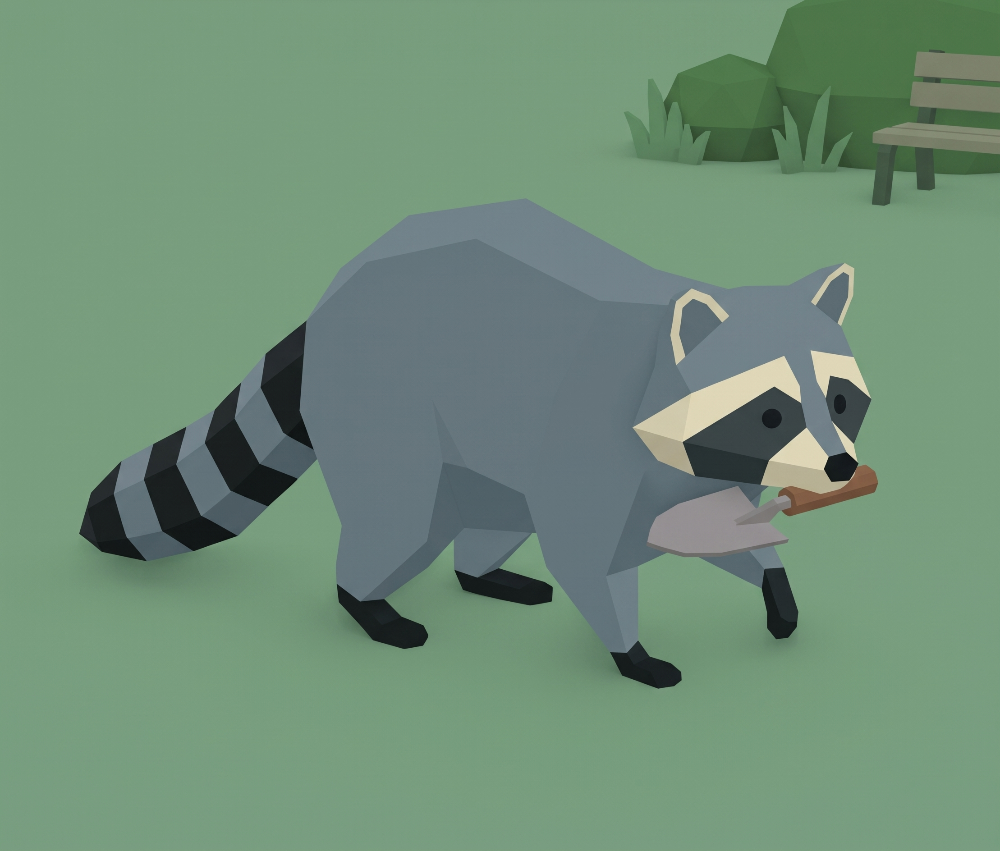
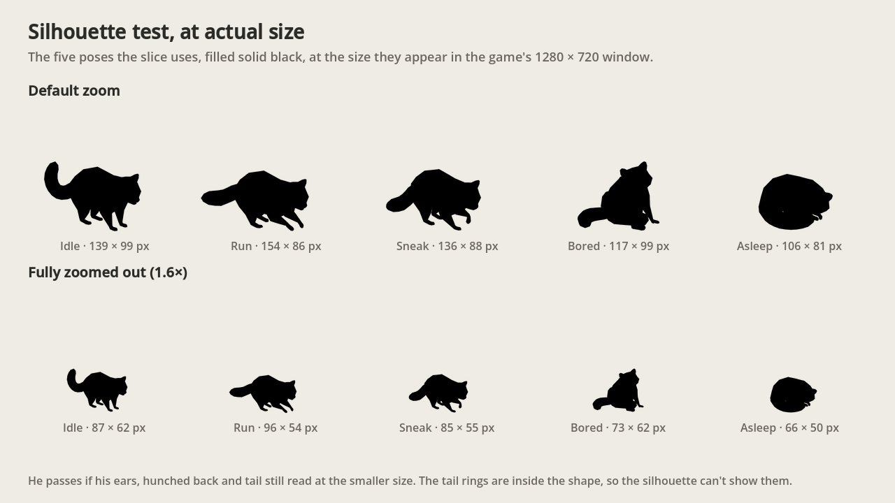
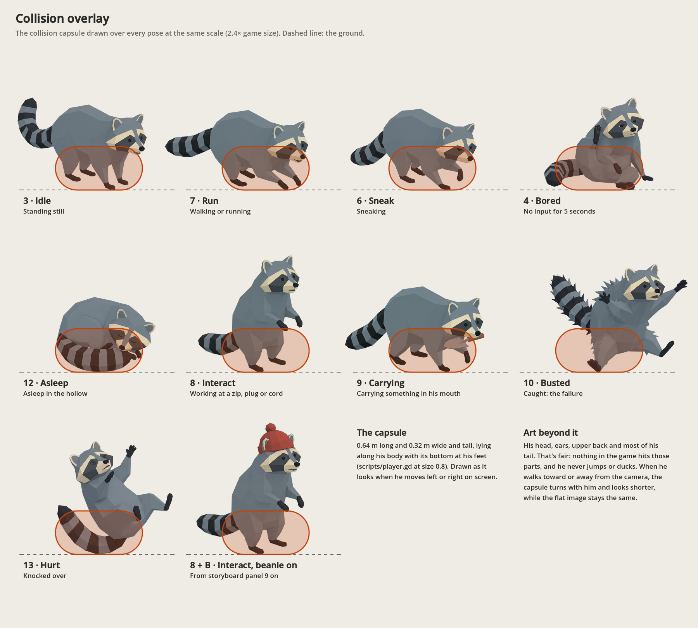
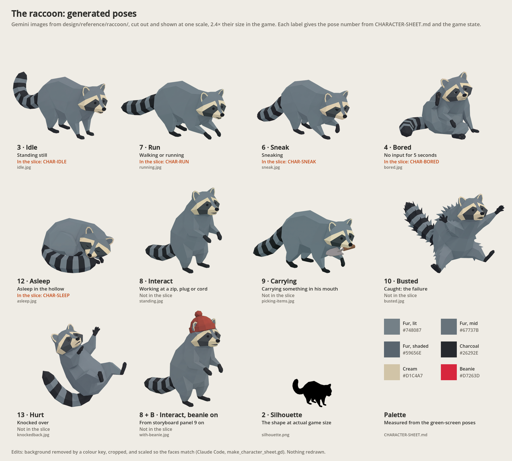

# Character sheet: the raccoon, the camper and the dogs

`the-noise-next-door` · CSYE 7270 · Assignment 2 · Draft v6, 6 Oct 2026 · first committed as v1 on 5 Oct 2026 (0998c52)

The story has two main characters: the raccoon, whom the player controls, and the camper, whose red beanie he steals and who in the end brings him home. In town, the neighbourhood dogs are the ones who chase him. This sheet is the contract every generated image of them must meet. It was first committed before any new generation, so the poses are a plan for now. The generated images go in `design/character/` once each reference image is accepted, and each one is judged against this sheet.

**Revised in v5 (6 Oct 2026): the low-poly look.** The raccoon now follows the low-poly look of his generated poses, not the clay look of the first style target. Each part of his section that changed keeps its v1–v4 text, marked as the earlier plan, so the record shows both. The camper and the dogs keep their v4 descriptions for now, because the slice doesn't use them.

**Added in v6 (6 Oct 2026): the images.** The silhouette test, the labelled pose sheet and the collision overlay are in `design/character/`. They're made from the generated poses by `design/character/make_character_sheet.gd`, which:
- cuts each pose out of its background with a colour key;
- crops it;
- scales every pose so the faces match.

Nothing is redrawn. The cut-outs are in `design/character/cutouts/`, and `cutouts.json` records each one's scale on screen and its ground point.


*The first style target, generated with Gemini before any design doc was committed (REF-STYLE in [SOURCES.md](SOURCES.md)). Versions 1–4 of this sheet follow it.*



*The low-poly raccoon, generated with Gemini on 5 Oct. From v5, his section follows this look, and so do all his generated poses. Its row in the asset log is still to be added.*

## The raccoon (the player character)

### Who he is

- A raccoon who lives alone in a hole in an old tree by a campsite. He loves three things: quiet, naps and snacks.
- He's curious, sneaky and greedy, but never mean (pillar 2). When he's caught he's more embarrassed than scared, and a minute later he's back at it.
- At a glance, the player should read "a raccoon up to something": a chunky body low to the ground, a masked face and a striped tail.
- He swipes the camper's red beanie in panel 8 of the storyboard and wears it from then on.

### How he looks

**Revised in v5 (6 Oct 2026).** He follows the low-poly raccoon above.
- **Why** (your words, 6 Oct): "the switch was a decision based on the astetics of the game and how the prototype looked"
- **Finish:** low-poly and faceted. Flat-shaded facets with crisp edges, not smooth clay. No outlines, fur strands, whiskers or claws. Soft light from the upper left.
- **Fur:** cool blue-grey instead of warm grey. See the palette.
- **Unchanged:** the proportions, face pattern, ears, socks, tail rings and beanie described below. Check them against the low-poly reference now, not the clay one.

*As planned in v1–v4 (the clay look). The finish and the fur colour are replaced by the v5 lines above:*

He follows the style target.

- **Finish:** a soft, matte, rounded 3D toy look, like smooth modelling clay. Simple chunky shapes, with no fur strands, outlines, whiskers or claws. He's shaded by soft light from the upper left.
- **Proportions,** standing on all fours:
  - from nose to tail tip, he's about 1.65 times as long as he is tall (ground to the top of his back);
  - his body is a rounded, hunched bean, highest just behind the middle and sloping down to the head;
  - his belly is about 30% of his height off the ground, on short, thick legs;
  - his head is about a third as long as his body, with a short pointed snout;
  - his tail is thick and tapering, about 60% as long as his body, and held low.
- **Face:** a grey head. A cream band runs above the eyes. A charcoal mask crosses both eyes and joins over the bridge of the nose. His cheeks and muzzle are cream, his nose is small and dark, and his small dark eyes sit inside the mask.
- **Ears:** rounded and upright, set wide on top of the head, grey outside and charcoal inside.
- **Body:** warm grey all over. A cream bib runs from the cheeks down the chest, and there's a cream patch on the belly between the legs.
- **Legs and paws:** grey legs ending in charcoal socks. Each paw has three toe grooves and no claws.
- **Tail:** five charcoal rings alternating with grey, evenly spaced. The fifth ring is the tip.
- **The beanie** (panel 9 on): a knitted red beanie with a folded brim and a pompom, pulled on over the top of his head with his ears poking up through it. It's the only red thing in the game.

### Palette

**Revised in v5 (6 Oct 2026).** Measured from the six green-screen poses (idle, sneak, bored, asleep, busted and knocked back), with the green removed, by sorting their pixels into six colour groups. The low-poly shading splits his fur into three facet tones.

| Colour | Hex | Where | Share of his pixels |
|---|---|---|---|
| Fur, lit facets | `#748087` | fur facing the light | 28% |
| Fur, mid facets | `#67737B` | most of his fur | 31% |
| Fur, shaded facets | `#59656E` | fur turned away from the light | 15% |
| Charcoal | `#26292E` | mask, inside the ears, socks, tail rings, nose and eyes | 16% |
| Cream | `#D1C4A7` | brow band, cheeks and muzzle | 6% |
| Beanie red | `#D7263D`, brim shadow `#A51C2E` | the beanie only (unchanged) | — |

The other 5% is a dark grey, `#42484C`, in the deepest folds.

**Checked against the grounds he'll stand on.** The numbers are contrast ratios; 3:1 or more reads clearly as a shape.

| Ground | Fur (mid) | Charcoal | Cream |
|---|---|---|---|
| ENV-GROUND, the generated grass texture: its average, `#627753` | 1.0 | 3.0 | 2.8 |
| ENV-GROUND's dark patches, `#475940` | 1.6 | 1.9 | 4.4 |
| ENV-GROUND's light patches, `#7D9771` | 1.5 | 4.5 | 1.9 |
| The game's current ground, `#7A9872`, from a screenshot | 1.5 | 4.5 | 1.9 |

What this means:
- His fur is about as bright as either ground (1.0 to 1.6), so only his charcoal markings and cream face show his shape. It's the same problem v1 found for the clay raccoon on the daytime garden.
- This is predicted failure 2 in CHANGE-BRIEF.md, which plans to fix the ground, not the raccoon.
- Darkening the ground texture to an average near `#3C4932` would give his fur about 2:1 and his face about 5.5:1, but his charcoal markings would sink (about 1.5:1). Settle this with the silhouette test and the muted playtest.

*As planned in v1–v4 (the clay look):* the four raccoon colours are measured from the style target's lit areas. The beanie's colours come from the storyboard.

| Colour | Hex | Where |
|---|---|---|
| Warm grey | `#9A8F8A` | fur |
| Charcoal | `#373732` | mask, inside the ears, socks, tail rings |
| Cream | `#D9CEBB` | brow band, cheeks and muzzle, bib, belly patch |
| Near-black | `#252822` | nose and eyes |
| Beanie red | `#D7263D`, brim shadow `#A51C2E` | the beanie only |

**Checked against the game's grounds.** The numbers are contrast ratios; 3:1 or more reads clearly as a shape.

| Ground | Fur | Charcoal | Cream | Beanie |
|---|---|---|---|---|
| Campsite ground at night `#2B474C` | 3.2 | 1.2 | 6.4 | 2.0 |
| Campsite grass at night `#40665F` | 2.0 | 1.9 | 4.1 | 1.3 |
| Town asphalt `#474B54` | 2.8 | 1.4 | 5.6 | 1.8 |
| Town sidewalk `#59606C` | 2.0 | 1.9 | 4.1 | 1.3 |
| The prototype's daytime garden `#7B9471` | 1.1 | 3.6 | 2.1 | 1.5 |

What this means for the images:
- At night, his grey fur and cream carry his shape, and the charcoal parts sink into the ground.
- In the prototype's daytime garden it's the other way round. His fur is as bright as the grass, and only the charcoal socks, mask and tail rings show his shape.
- So every image must keep his strong light-and-dark pattern, with cream and charcoal against grey. Reject images that drift towards an all-mid-grey raccoon.
- The beanie stands out by its colour rather than its brightness: it's the only red on screen.

### Facing

The player sees him through the game camera: a tilted three-quarter view, about 50° down, that follows him. See the legend in STORYBOARD.md.

*Revised in v5 (6 Oct 2026):* the camera you picked in the game looks down 27° through a narrow 15° lens (STORYBOARD.md's legend, v6). The slice uses only front-right images, mirrored for the left. There are no back-right images yet (CHANGE-BRIEF.md).

- **Generate two facings:** front-right (seen from above and in front, heading towards the camera and to the right) and back-right (seen from above and behind, heading away and to the right).
- **Mirror both at runtime** for front-left and back-left. His markings are symmetrical, so mirroring is safe.
- Moving straight up, down, left or right uses the nearest of the four.
- Every pose is generated facing front-right. The states the slice uses also get a back-right version. CHANGE-BRIEF.md picks those states.
- Side views only appear in the storyboard's design-view cutscenes, so the game doesn't need them.

### Silhouette test

*To do once the reference image is accepted.* Fill the image solid black and shrink it to his on-screen size. In the prototype's 1280 × 720 window he's about 130 px tall on screen at the default zoom, and the mouse wheel zooms in or out from there. So test him at 128 px and at 64 px. He passes if his ears, hunched back and ringed tail still read at 64 px.

*Revised in v5 (6 Oct 2026):* with your camera, he's about 162 px long and 85 px tall in a 1280 × 720 window at the default zoom, measured from a screenshot. Fully zoomed out, he's about 100 px long. So test him at 96 px and 64 px long, against the v5 grounds above.

**Done in v6 (6 Oct 2026).**



The five poses the slice uses, in solid black at their actual size in the game's window: 106–154 px wide at the default zoom, and 66–96 px fully zoomed out.

*Claude's read of the image:*
- Idle, run, sneak and bored keep their ears, hunched back and tail at both sizes.
- Asleep reads as a curled ball. His ears and tail only just show at the smaller size.
- The tail rings can't show in a silhouette; the contrast check above covers them.

The muted playtest settles whether he reads in the game.

### Collision

The prototype's player collides as a capsule lying along his body, 0.8 m long and 0.4 m wide and tall, with its bottom at his feet (`scripts/player.gd`). Draw it over every pose at the same scale.

*Corrected in v5 (6 Oct 2026):* a size setting of 0.8, added on 5 Oct (11e0319), scales the capsule, so it's 0.64 m long and 0.32 m wide and tall (radius 0.16 m). The reasoning below is unchanged.

The capsule covers his legs and lower body. His snout, upper back, head and most of his tail stick out past it. That's fair to the player because nothing in the game needs to hit those parts: there's no jumping or ducking. And if humans check the same capsule when they look for him, a tail poking out of a hiding place never gets him caught.

**Drawn in v6 (6 Oct 2026).**



- The capsule is drawn over every pose at the same scale, centred between his front and hind paws, with its bottom on the ground line.
- It's shown as it looks when he moves left or right on screen.
- When he walks toward or away from the camera, the capsule turns with him and looks shorter, but the flat image stays the same. TEST-REPORT.md checks how that plays.

### Poses

The plan is 12 poses, each a single image for one game state. Every pose except the turnaround faces front-right in the game view. Generate each one from the accepted reference image, never from text alone.

| # | Pose | Game state | Storyboard panels |
|---|---|---|---|
| 1 | Turnaround: front, side, three-quarter and back, all the same height | Reference | — |
| 2 | Silhouette at game size | Reference | — |
| 3 | Standing on all fours, tail curled, looking around | Idle | 3, 10 |
| 4 | Sitting back, scratching an ear with a hind paw | Bored (no input for a few seconds) | — |
| 5 | One trotting stride | Walk | 3, 10 |
| 6 | Belly low, tiptoeing, one front paw lifted high | Sneak | 5 |
| 7 | Stretched out mid-gallop, ears back, tail streaming behind | Run and getaway | 8, 12 |
| 8 | Up on his hind legs, front paws working at chest height | Interact: zippers, plugs, bungee cords | 5, 6, 10 |
| 9 | Trotting with the marshmallow bag in his mouth, tail held high | Carrying | 6, 7, 12 |
| 10 | Mid-jump, fur on end, eyes wide | Busted (failure) | 7 |
| 11 | Up on his hind legs, rubbing his paws together, with a sly grin | Job done (success) | 6, 15 |
| 12 | Curled up nose to tail, eyes closed | Asleep (intro and ending) | 1 |

From panel 9 on he wears the beanie. Make the beanie version of a pose by editing its accepted image with prompt B below, not by generating from scratch.

**Generated so far (v5, 6 Oct 2026).** These are Gemini images in `design/reference/raccoon/`, all in the low-poly look. Each still needs its row in the asset log.

| # | Pose | Image | Background | In the slice |
|---|---|---|---|---|
| 3 | Idle | `idle.jpg` | Green | Yes, as CHAR-IDLE |
| 4 | Bored | `bored.jpg` | Green | Yes, as CHAR-BORED |
| 6 | Sneak | `sneak.jpg` | Green | Yes, as CHAR-SNEAK |
| 7 | Run | `running.jpg` | Scene | Yes, as CHAR-RUN |
| 8 | Interact: up on his hind legs, front paws at chest height | `standing.jpg` | Scene | No |
| 9 | Carrying, with a garden trowel in his mouth. This is also the low-poly reference, `the-raccon.jpg`. | `picking-items.jpg` | Scene | No |
| 10 | Busted | `busted.jpg` | Green | No |
| 12 | Asleep | `asleep.jpg` | Green | Yes, as CHAR-SLEEP |
| 13 (new) | Hurt: knocked over backwards, dizzy, with stars and spirals | `knockedback.jpg` | Green | No |
| 8 + B | Standing with the beanie | `with-beanie.jpg` | Scene | No |

- **Not generated yet:** 1 (the turnaround), 5 (walk) and 11 (job done).
- **Count:** with the silhouette (pose 2), that's 10 distinct poses. The beanie version is a variation of standing, so it doesn't count again.

**The pose sheet (v6).** Every generated pose at one scale, cut out and labelled with its pose number and game state. The five the slice uses are marked with their asset IDs.



### Consistency rules

Every image must keep these exactly the same:
- the proportions above, checked against the turnaround;
- the face pattern: cream brow band, charcoal mask joined over the nose, cream cheeks and muzzle, small dark eyes inside the mask, a small dark nose;
- five charcoal tail rings, the fifth being the tip;
- charcoal socks on all four legs, three toe grooves on each paw, no claws;
- rounded ears, charcoal inside;
- the palette, with nothing else on him except the beanie and whatever he's holding;
- the finish: matte and smooth, with no outlines, fur strands or whiskers;
- soft light from the upper left, and no cast shadow in the image (the game draws his shadow);
- with the beanie on: the same beanie, at the same size and position, with his ears through it;
- a flat, solid background colour, so it can be removed cleanly.

*Revised in v5 (6 Oct 2026):* the finish rule is now "low-poly and faceted: flat-shaded facets with crisp edges, no outlines, fur strands or whiskers", and the colours are judged against the v5 palette. In the reject list, "a realistic look" now also covers smooth clay surfaces instead of facets.

**Reject an image if:**
- the tail has the wrong number of rings, or uneven ones;
- the mask splits into two patches, or the eyes sit outside it;
- it has claws, whiskers, fur strands, outlines or a realistic look;
- the proportions drift from the reference: longer legs, a slimmer body or a bigger head;
- the colours drift off the palette, or the light-and-dark pattern flattens into mid-grey;
- the background has a floor, a gradient, a shadow or a drawn checkerboard;
- there's any text, logo or watermark;
- the beanie hides his ears or changes shape between poses.

## The camper (the other main character)

### Who he is

- He's the camper whose red beanie the raccoon ends up wearing, and the story turns on him. He's the one who chases the raccoon out of the forest, and in the end he's the one who brings him home and lets him go.
- **At the party (panels 2–8)** he's a creature of habit: he roasts marshmallows, sips cocoa and keeps a journal. As his things go missing he gets jumpier. His phone light comes out in panel 7, and a frying pan in panel 8. He catches the raccoon, trips over the cooler, chases him, and loses his beanie to him.
- **In town** he isn't on screen. But when the photo of the masked bandit goes round, he recognises his own beanie.
- **At the end (panel 14)** he's the only one who knows where the raccoon lives, because he chased him out of there. He drives him home, opens the carrier under his tree, and lets him keep the beanie.
- He never wants to hurt the raccoon, only to get his stuff back (pillar 2), and his tumbles are pratfalls, never injuries. He's the story's straight man: the raccoon's pranks need someone to land on, and the ending needs that someone to turn out kind.
- He has no lines. He grumbles, gasps, yelps and laughs, and his posture does the rest.

### How he looks

This is Claude's suggestion, and it matches the storyboard.

- **Finish:** the same as the raccoon's: a soft, matte, rounded 3D toy look, like smooth modelling clay. Simple chunky shapes, a round head with small dot eyes, no outlines.
- **Proportions:** chunky, about 4½ heads tall. Standing beside him, the raccoon's back comes up to about his mid-thigh.
- **Clothes:** a mustard-yellow zip-up jacket, blue jeans and dark shoes. No logos or text.
- **Hair and beard:** short, messy brown hair and a short, rounded brown beard. The beard makes him easy to pick out from the other partiers, even from the game camera.
- **The beanie:** the same knitted red beanie with a folded brim and a pompom. He wears it until panel 8, and after that his hair sticks up where it was.
- **Props:** a marshmallow-roasting stick, his phone (its light in panel 7, the beanie photo in panel 14), and a frying pan (panel 8).

### Palette

| Colour | Hex | Where |
|---|---|---|
| Mustard | `#E0B03C` | jacket |
| Denim blue | `#3F5A86` | jeans |
| Brown | `#4A3426` | hair and beard |
| Skin | `#E6B48F` | face and hands |
| Beanie red | `#D7263D`, brim shadow `#A51C2E` | the beanie, until panel 8 |

| Ground | Jacket | Jeans | Hair | Skin | Beanie |
|---|---|---|---|---|---|
| Campsite ground at night `#2B474C` | 5.0 | 1.4 | 1.2 | 5.4 | 2.0 |
| Campsite grass at night `#40665F` | 3.2 | 1.1 | 1.8 | 3.4 | 1.3 |
| Town asphalt `#474B54` | 4.3 | 1.3 | 1.3 | 4.7 | 1.8 |

At night his mustard jacket is what you see first, so keep it in every image. His jeans and hair sink into the dark, like the raccoon's socks. Next to the raccoon the two are told apart by colour, warm mustard against cool grey, rather than by brightness (1.6:1).

### Facing

- In level 1 he's in the gameplay view, so he gets the raccoon's two facings: front-right and back-right, mirrored for the left.
- His big moments (panels 7, 8 and 14) are design-view cutscenes, so their images can use whatever angle tells the moment best.
- Collision is only needed if he walks around in the slice. Then he'd use a standing capsule about 0.6 m wide and 1.75 m tall.

### Poses

The plan is 9 poses, one for each beat of his story.

| # | Pose | Story beat | Storyboard panels |
|---|---|---|---|
| C1 | Turnaround: front, side, three-quarter and back, all the same height | Reference | — |
| C2 | Sitting on a log, roasting a marshmallow on a stick, relaxed | His routine | 2, 3, 5 |
| C3 | Spinning round, phone light held out, mouth open | Catching the raccoon | 7 |
| C4 | Lunging forward, one foot hooked on a cooler | The pratfall | 7 |
| C5 | Running with a frying pan raised, no beanie, hair sticking up | The chase | 8 |
| C6 | Bare-headed, a hand on his hair where the beanie was, huffy | Losing the beanie | 8 |
| C7 | Looking at his phone, eyebrows up, recognising his beanie in a photo | Finding the bandit | just before 14 |
| C8 | Kneeling to open a pet carrier, with a gentle smile | Bringing him home | 14 |
| C9 | Hands in his jacket pockets, smiling as he watches the raccoon go | Letting him keep the beanie | 14 |

### Consistency rules

Every image of him must keep these exactly the same:
- the finish and proportions of his turnaround: chunky, about 4½ heads tall, a round head with dot eyes;
- the mustard jacket, blue jeans, dark shoes, messy brown hair and short beard;
- before panel 8 he wears the beanie, and from panel 8 on he's bare-headed with his hair sticking up;
- his beanie is exactly the raccoon's beanie: the same knit, folded brim, pompom and red;
- no other red on him, and no text or logos on his clothes;
- the same background and no-shadow rules as the raccoon.

**Reject an image if** his jacket colour drifts, his beard or hair changes, the beanie changes shape or colour, he looks realistic rather than like a clay toy, his proportions drift from the turnaround, or there's any text or logo.

## The neighbourhood dogs (the town's chasers)

### Who they are

- Three dogs from the block. In town they're the raccoon's rivals, the way the camper is at the campsite: each guards its own patch and chases him in its own way.
- They're excitable, not vicious. Their tails wag even mid-chase, and they bark and yap but never bite (pillar 2).
- If one corners him, it just barks its head off until he slips away. The barking brings the neighbours out with their phones, and in panel 11 it brings animal control too.
- The player beats them by outsmarting them (pillar 1): climbing out of reach, letting a leash run out, tossing them a snack, or steering them into a crash.
- In the storyboard all three chase him in panel 11 and end up barking up the wrong tree. The sausage dog turns up again in panel 12, leaping for the sausage string.

### The three dogs

| Dog | Look | How it chases | Panels |
|---|---|---|---|
| The sausage dog | A long, low dachshund: a tan coat, darker floppy ears and a teal collar | Fast on the flat, nose to the ground, and it follows his smell anywhere. But it can't climb, and it stops dead for anything edible. | 11, 12 |
| The big shaggy dog | A huge, shaggy, off-white dog with slate-grey patches, a fringe over its eyes and a yellow collar | Usually asleep across the alley. It's slow to get going and too big for the gaps under fences, but its one huge bark wakes the whole street. | 11 |
| The tiny yappy dog | A tiny apricot fluffball with a purple collar | The fastest and loudest of the three: you hear it before you see it. It bounces off things, and it can't reach him on top of a bin. | 11 |

### How they look

- **Finish:** the same as the raccoon's and the camper's: a soft, matte, rounded 3D toy look, like smooth modelling clay. Simple chunky shapes, small dot eyes, no outlines. Shaggy or fluffy fur is shaped as soft clay clumps, not fine strands.
- **Faces:** friendly. Their mouths open wide when they bark, but they never show fangs, snarls or bared teeth.
- **Collars:** every dog wears one in its own colour, never red.
- **Sizes, next to the raccoon:**
  - the sausage dog is about as long as he is and two-thirds his height;
  - the big shaggy dog is about twice his height;
  - the tiny dog is about half his height.

### Palette

| Dog | Colours |
|---|---|
| The sausage dog | tan `#B0703E`, ears `#8A5530`, teal collar `#4FB3A9`, pink tongue `#F09AB0` |
| The big shaggy dog | off-white `#EEE7DA`, slate patches `#7C8798`, yellow collar `#F2C14E` |
| The tiny yappy dog | apricot `#F0C08A`, purple collar `#9B8FC9` |

| Against | Sausage tan | Sausage ears | Big dog white | Big dog slate | Tiny dog apricot | Collars |
|---|---|---|---|---|---|---|
| Town asphalt `#474B54` | 2.2 | 1.4 | 7.1 | 2.4 | 5.2 | 3.0–5.2 |
| The raccoon's fur `#9A8F8A` | 1.3 | 1.9 | 2.6 | 1.2 | 1.9 | — |

- The big dog and the tiny dog read easily at night.
- The sausage dog is the hardest to see. Its tan is only 2.2:1 against the asphalt and close to the raccoon's grey in brightness. Its long, low shape, its teal collar (3.5:1) and its warm colour against his cool grey do the work, so keep all three in every image.

### Facing and collision

- They run around in the gameplay view, so they get the raccoon's two facings: front-right and back-right, mirrored for the left.
- Each dog collides as a capsule lying along its body, like the raccoon's. The sausage dog's is about 0.7 m long and 0.25 m wide, the big dog's about 1.1 m by 0.55 m, and the tiny dog's about 0.35 m by 0.2 m.
- A dog corners the raccoon only when their capsules touch. So a flapping ear or a wagging tail never counts, which is fair to the player.

### Poses

The plan is 8 poses for each dog, the ones the game uses.

| # | Pose | Game state |
|---|---|---|
| D1 | Turnaround: front, side, three-quarter and back, all the same height | Reference |
| D2 | Lying down asleep, chin on its paws | Guarding, asleep |
| D3 | Head up, ears perked, nose sniffing the air | Alert: it's noticed something |
| D4 | Front paws planted, mouth wide open in a bark, tail wagging | Barking: it gives him away |
| D5 | Running flat out, ears flying, tongue out, tail wagging | Chasing |
| D6 | Skidding to a stop, legs splayed, a little dizzy | Lost him, or crashed |
| D7 | Sitting happily, munching a sausage | Distracted by a snack |
| D8 | Up on its hind legs, front paws on a tree trunk, barking up it | Treed: it thinks he's up there (panel 11) |

### Consistency rules

Every image of a dog must keep these exactly the same:
- its colours, collar and proportions, checked against its turnaround;
- a friendly face, with no fangs, snarls or bared teeth, even when barking;
- the same finish, background and no-shadow rules as the raccoon;
- no red anywhere.

**Reject an image if** it shows teeth or a snarl, the dog looks realistic, its collar changes colour or disappears, the sausage dog loses its long, low shape, or there's any text.

## Generating with Gemini

1. **Reference turnarounds (prompts R1, C-R1 and D-R1).** Attach the style target image. Generate a few of each and pick the one that best matches this sheet. Save them as `design/character/ref-<name>-turnaround.png`, for example `ref-raccoon-turnaround.png`. Then add the height bar yourself, as two lines across the tops and bottoms of the views; asking Gemini for one tends to add numbers. If you later turn a character into a 3D model with an image-to-3D tool, these turnarounds are the input those tools want.
2. **Game-view references (prompts R2, C-R2 and D-R2).** Attach the accepted turnaround.
3. **Scale checks (prompts S and D-S).** Attach two game-view references, to lock how big the characters are next to each other.
4. **Poses (prompts P, C-P and D-P).** For each pose, start a new image from the accepted game-view reference. Make one pose per image.
5. **Check before accepting.** Look at each image at game size, against the consistency rules and the reject list. You can ask Gemini to fix one thing in an image ("give the tail five evenly spaced rings"); record that in the Edits column.
6. **Remove the background colour afterwards.** Don't ask for "transparent": that gives a drawn checkerboard.
7. **Log as you go.** Add a row to SOURCES.md for every image you keep or seriously consider. Record the exact prompt, the attached image, the aspect ratio, the date, and the model name and version Gemini shows. Gemini doesn't show a seed, so say so. Keep rejects as small thumbnails.

The prompts follow the brief's rules: no brand, studio, artist or game names; a flat background colour; no text.

### Raccoon prompts

*Revised in v5 (6 Oct 2026):* for every raccoon prompt below:
- attach the low-poly reference (`design/reference/the-raccon.jpg`) or an accepted pose, instead of the first style target;
- write "low-poly faceted finish" where it says "clay finish";
- in R1, replace the clay description with "a low-poly, faceted, flat-shaded 3D look", and the warm grey `#9A8F8A` with blue-grey fur `#67737B`.

CHANGE-BRIEF.md has the CHAR-CLIMB prompt already written this way.

**R1: reference turnaround.** Attach the style target.

```text
Use the attached image as the style reference. Make a character turnaround sheet of this cartoon raccoon: the same raccoon four times, side by side and exactly the same height, as a front view, a side view facing right, a three-quarter view facing front-right, and a back view. Soft, matte, rounded 3D toy look, like smooth modelling clay: simple chunky shapes, no fur strands, no outlines, no whiskers, no claws. A hunched, rounded body, highest just behind the middle; short, thick legs; a short pointed snout; a thick, tapering tail about 60% as long as the body. Warm grey fur (#9A8F8A). A cream (#D9CEBB) band above the eyes, cream cheeks and muzzle, and a cream bib down the chest. A charcoal (#373732) mask across both eyes, joined over the bridge of the nose, with small dark eyes inside it, and a small dark nose. Rounded ears, charcoal inside. Charcoal socks on all four legs; paws with three toe grooves. Five evenly spaced charcoal rings on the tail; the fifth ring is the tip. Soft light from the upper left. No cast shadows. Plain, flat, solid bright green background (#22C55E), no floor line, no gradient. Wide 16:9 image. No text, no labels, no watermark.
```

**R2: game-view reference.** Attach the accepted turnaround.

```text
Use the attached raccoon as the exact reference: keep his proportions, face pattern, colours, five tail rings and clay finish exactly the same. Show him once, standing on all four legs, seen from a high three-quarter angle, as if the camera is above and in front of him looking down at about 50 degrees, with his body turned to face front-right. Full body in frame and centred, with space around him. No cast shadow. Plain, flat, solid bright green background (#22C55E), no floor, no gradient. Square image. No text, no watermark.
```

**P: each pose.** Attach the accepted game-view reference, and replace `[POSE]` with the pose's line from the table below.

```text
Use the attached raccoon as the exact reference: keep his proportions, face pattern, colours, five tail rings, clay finish, camera angle and front-right facing exactly the same. Change only his pose: [POSE]. Full body in frame and centred. No cast shadow. Plain, flat, solid bright green background (#22C55E), no floor, no gradient. Square image. No text, no watermark.
```

For the back-right facing, change "front-right facing" to "back-right facing, seen from above and behind".

| # | Pose | `[POSE]` |
|---|---|---|
| 3 | Idle | standing on all fours, relaxed, tail curled up behind him, head turned a little as he looks around |
| 4 | Bored | sitting back on his haunches, scratching behind one ear with a hind paw, eyes half closed |
| 5 | Walk | mid-stride in a trot, one front paw and the opposite hind paw lifted |
| 6 | Sneak | sneaking with his belly low to the ground, tiptoeing with one front paw lifted high, tail held low, eyes narrowed |
| 7 | Run | running flat out, body stretched long, all four paws off the ground, ears back, tail streaming out behind |
| 8 | Interact | standing up on his hind legs, front paws held up at chest height as if working at a zipper, tongue poking out in concentration |
| 9 | Carrying | trotting with a small pink-and-white bag of marshmallows held in his mouth, tail held high, looking proud |
| 10 | Busted | jumping straight up in shock, all four legs splayed, fur standing up in spikes, eyes wide open |
| 11 | Job done | standing on his hind legs, rubbing his front paws together, with a sly, pleased grin |
| 12 | Asleep | curled up asleep in a ball, nose tucked into his tail, eyes closed |

**B: with the beanie.** Attach an accepted pose image.

```text
Use the attached image exactly: the same raccoon, pose, camera angle and background. Change only one thing: he now wears a knitted red beanie (#D7263D) with a folded brim and a red pompom, pulled on over the top of his head, with his ears poking up through it. No other red anywhere. No text, no watermark.
```

### Camper prompts

**C-R1: reference turnaround.** Attach the style target for its finish and lighting.

```text
Use the attached image only as the style reference for the finish and lighting. Make a character turnaround sheet of one cartoon young man, a camper: the same man four times, side by side and exactly the same height, as a front view, a side view facing right, a three-quarter view facing front-right, and a back view. Soft, matte, rounded 3D toy look, like smooth modelling clay: simple chunky shapes, about 4.5 heads tall, a round head with small dot eyes, no outlines. He wears a mustard-yellow (#E0B03C) zip-up jacket, blue jeans (#3F5A86), dark shoes, and a knitted red beanie (#D7263D) with a folded brim and a pompom. Short, messy brown (#4A3426) hair shows under the beanie, and he has a short, rounded brown beard. Friendly, a bit anxious. Soft light from the upper left. No cast shadows. Plain, flat, solid bright green background (#22C55E), no floor line, no gradient. Wide 16:9 image. No text, no labels, no logos, no watermark.
```

**C-R2: game-view reference.** Attach the accepted turnaround.

```text
Use the attached man as the exact reference: keep his proportions, clothes, colours, hair, beard, beanie and clay finish exactly the same. Show him once, standing, seen from a high three-quarter angle, as if the camera is above and in front of him looking down at about 50 degrees, with his body turned to face front-right. Full body in frame and centred, with space around him. No cast shadow. Plain, flat, solid bright green background (#22C55E), no floor, no gradient. Square image. No text, no logos, no watermark.
```

**C-P: each pose.** Attach the accepted game-view reference, and replace `[POSE]` with the pose's line below. Each line says whether he has the beanie.

```text
Use the attached man as the exact reference: keep his proportions, clothes, colours, hair, beard and clay finish exactly the same. Change only his pose: [POSE]. Full body in frame and centred. No cast shadow. Plain, flat, solid bright green background (#22C55E), no floor, no gradient. Square image. No text, no logos, no watermark.
```

| # | Pose | `[POSE]` |
|---|---|---|
| C2 | Roasting | sitting on a log, relaxed, roasting a marshmallow on a long stick, wearing his red beanie |
| C3 | Spinning round | spinning round in surprise, holding his phone out with its light on, mouth open, wearing his red beanie |
| C4 | The pratfall | lunging forward with his arms out, one foot hooked on a blue cooler, about to trip, wearing his red beanie |
| C5 | The chase | running with a frying pan raised, no beanie, his messy hair sticking up |
| C6 | Lost beanie | standing with no beanie, one hand on top of his messy hair where it used to be, looking huffy |
| C7 | Recognising | looking at his phone with his eyebrows raised, recognising something in a photo, no beanie |
| C8 | Bringing him home | kneeling to open the door of a pet carrier, with a gentle smile, no beanie |
| C9 | Letting go | standing with his hands in his jacket pockets, smiling softly as he watches something go, no beanie |

### Dog prompts

**D-R1: reference turnaround.** Attach the style target for its finish and lighting, and replace `[DOG]` with the dog's line.

```text
Use the attached image only as the style reference for the finish and lighting. Make a character turnaround sheet of one cartoon dog: the same dog four times, side by side and exactly the same height, as a front view, a side view facing right, a three-quarter view facing front-right, and a back view. Soft, matte, rounded 3D toy look, like smooth modelling clay: simple chunky shapes, small dot eyes, no outlines, no fine fur strands. [DOG] A friendly face: no fangs, no bared teeth. Soft light from the upper left. No cast shadows. Plain, flat, solid bright green background (#22C55E), no floor line, no gradient. Wide 16:9 image. No text, no labels, no logos, no watermark.
```

| Dog | `[DOG]` |
|---|---|
| The sausage dog | A long, low dachshund with very short legs: a tan (#B0703E) coat, darker brown (#8A5530) floppy ears, a long tail and a teal (#4FB3A9) collar. |
| The big shaggy dog | A huge, shaggy dog with long off-white (#EEE7DA) hair shaped in soft chunky clumps, slate-grey (#7C8798) patches, a fringe of hair over its eyes and a yellow (#F2C14E) collar. |
| The tiny yappy dog | A tiny, round, fluffy dog with apricot (#F0C08A) fur shaped as soft puffs, small pointed ears, a curly tail and a purple (#9B8FC9) collar. |

**D-R2: game-view reference.** Attach the accepted turnaround.

```text
Use the attached dog as the exact reference: keep its proportions, colours, collar and clay finish exactly the same. Show it once, standing, seen from a high three-quarter angle, as if the camera is above and in front of it looking down at about 50 degrees, with its body turned to face front-right. Full body in frame and centred, with space around it. No cast shadow. Plain, flat, solid bright green background (#22C55E), no floor, no gradient. Square image. No text, no watermark.
```

**D-P: each pose.** Attach the dog's accepted game-view reference, and replace `[POSE]` with the pose's line below.

```text
Use the attached dog as the exact reference: keep its proportions, colours, collar, clay finish, camera angle and front-right facing exactly the same. Change only its pose: [POSE]. A friendly face, no fangs, no bared teeth. Full body in frame and centred. No cast shadow. Plain, flat, solid bright green background (#22C55E), no floor, no gradient. Square image. No text, no watermark.
```

| # | Pose | `[POSE]` |
|---|---|---|
| D2 | Asleep | lying down asleep with its chin on its front paws, eyes closed |
| D3 | Alert | standing with its head up, ears perked and nose lifted, sniffing the air |
| D4 | Barking | front paws planted, mouth wide open in a big happy bark, tail wagging |
| D5 | Chasing | running flat out, ears flying back, tongue out, tail wagging |
| D6 | Skid | skidding to a stop with its legs splayed and a dizzy, cross-eyed look |
| D7 | Distracted | sitting happily, munching a sausage, tail wagging |
| D8 | Treed | up on its hind legs with its front paws on a tree trunk, barking up into the branches, tail wagging |

### Scale checks

**S: the raccoon and the camper.** Attach both accepted game-view references.

```text
Use the two attached characters as exact references and keep both exactly as they are. Show them standing side by side, seen from a high three-quarter angle, so their sizes can be compared: the top of the raccoon's back comes up to about the man's mid-thigh. No cast shadows. Plain, flat, solid bright green background (#22C55E), no floor, no gradient. No text, no logos, no watermark.
```

**D-S: the raccoon and a dog.** Attach the raccoon's and the dog's accepted game-view references, and replace `[SIZE]` with "about as long as the raccoon and two-thirds his height" for the sausage dog, "about twice the raccoon's height" for the big dog, or "about half the raccoon's height" for the tiny dog.

```text
Use the two attached characters as exact references and keep both exactly as they are. Show them standing side by side, seen from a high three-quarter angle, so their sizes can be compared: the dog is [SIZE]. No cast shadows. Plain, flat, solid bright green background (#22C55E), no floor, no gradient. No text, no logos, no watermark.
```

## Other characters, for inspiration only

The slice doesn't need these. Use the same style and background rules, and end each prompt with: *Soft, matte, rounded 3D toy look, like smooth modelling clay: simple chunky shapes, a round head, dot eyes, no outlines. Standing, front three-quarter view, full body. No cast shadow. Plain, flat, solid bright green background (#22C55E), no floor, no gradient. No text, no logos, no watermark.*

- **The animal-control officer** (panels 11–13). Patient, and smug when the trap works. Prompt: *A cartoon animal-control officer in a khaki (#B9A66F) uniform shirt with a round yellow badge, dark olive (#4B5233) trousers and an olive (#5E6B3A) peaked cap, holding a long-handled catch net upright.*
- **Partiers and neighbours.** Rounded people in plain colours (lilac, coral, mint, sky blue and pink, but never red), with no logos or text on their clothes.

## Open choices (not decided yet)

- **Eyes.** The style target's eyes are tiny dots, while the storyboard's are big and expressive. At game size the raccoon's face is only a few pixels, so this sheet keeps the small eyes and lets his pose, ears and tail carry the emotion. Bigger eyes would read better in close-ups.
- **Ears through the beanie.** This keeps his silhouette the same with and without it. The alternative is ears tucked under the brim.
- **Two facings, mirrored.** This halves the images to generate. Four separate facings would look a little better but take twice the work.
- **No cast shadow in the images.** The game draws a soft shadow under each character, so background removal stays clean.
- **Humans spot the raccoon by his collision capsule.** This is Claude's suggestion, and it's what makes the art beyond the capsule fair.
- **The camper's look.** His short hair and beard are Claude's suggestion. They replace the ponytail of earlier storyboard drafts, and you can change anything.
- **The camper's name.** He has none yet. The game never needs one, since there's no dialogue, but a name would make the docs easier to read.
- **Three dogs.** The trio and their chase styles are Claude's suggestion. Start with the sausage dog, since it's already in panel 12, and add the other two later if time allows.
- **What a dog costs him.** Here a dog that corners him only barks until he slips away, and the barking brings out the phones. A harsher version would make him drop whatever he's carrying.
- **Which states go in the slice.** CHANGE-BRIEF.md decides that; the brief needs at least two. *Decided on 6 Oct:* idle, run, sneak, bored and asleep (CHANGE-BRIEF.md v1).

## Provenance

- **Your decisions:**
  - the raccoon as the main character (CONCEPT.md), with the style target as his look;
  - the red beanie as the story's thread;
  - the tilted 3/4 game camera;
  - on 5 Oct 2026: the beanie camper is a man and the story's other main character, the one who releases the raccoon at his home;
  - on 5 Oct 2026: dogs in the town that chase the raccoon, as an important character;
  - on 6 Oct 2026: switch the raccoon to the low-poly look of his generated poses (v5), because "the switch was a decision based on the astetics of the game and how the prototype looked".
- **Claude's v6 contributions:**
  - `make_character_sheet.gd` and the images it makes: the cut-outs (colour key, crop, scale matched by face size), the silhouette test, the pose sheet and the collision overlay;
  - the read of the silhouette test.
- **Claude's v5 contributions:**
  - the revision's wording;
  - the palette, measured from the six green-screen poses;
  - the contrast check against ENV-GROUND and the game's ground;
  - his size on screen with the new camera;
  - the corrected capsule size;
  - the table matching generated images to poses, including the label for the new knocked-back pose.
- **Claude's contributions:**
  - the wording of this sheet;
  - the raccoon's proportions and palette, measured from the style target;
  - the contrast checks;
  - the camper's look, palette and pose plan;
  - the three dogs: their looks, chase styles, palettes, collision sizes and pose plan;
  - the facing plan, the pose lists, the consistency and reject rules, and the prompts.
  Claude doesn't make images; Gemini will.
- **Generative models:** none were used for this sheet. The style target was made with Gemini before any design doc was committed; see SOURCES.md.
