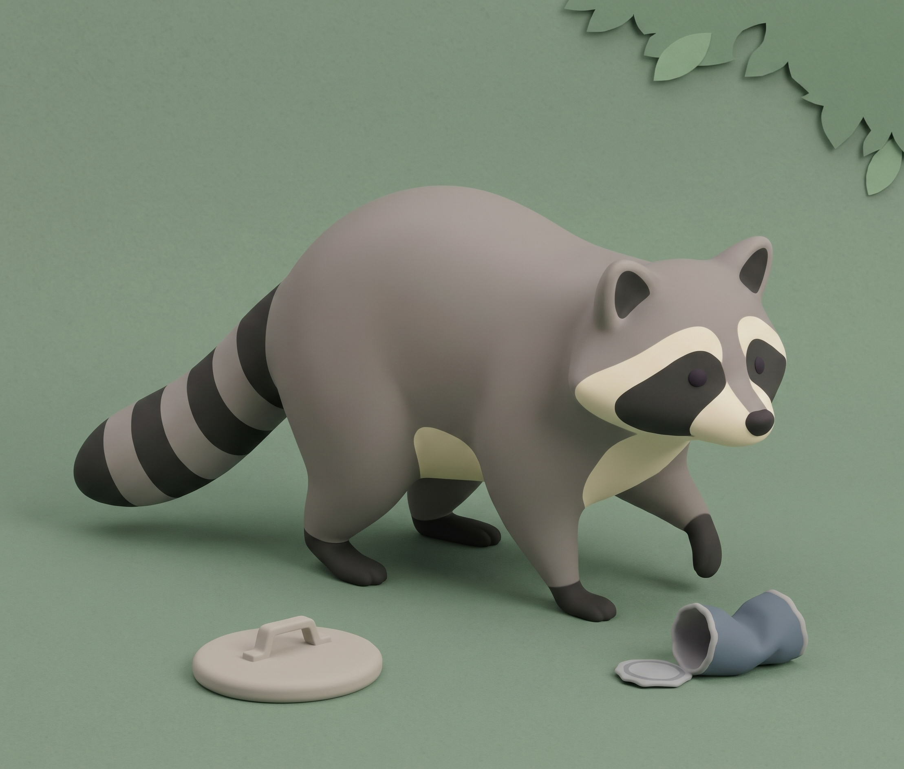

# Character sheet: the raccoon

`the-noise-next-door` · CSYE 7270 · Assignment 2 · Draft v1, 5 Oct 2026

This is the contract every generated image of the raccoon must meet. It's committed before any new generation, so the poses are a plan for now. The generated images go in `design/character/` once the reference image is accepted, and each one is judged against this sheet.



*The style target, generated with Gemini before any design doc was committed (logged in [SOURCES.md](SOURCES.md)).*

## Who he is

- A raccoon who lives alone in a hole in an old tree by a campsite. He loves three things: quiet, naps and snacks.
- He's curious, sneaky and greedy, but never mean (pillar 2). When he's caught he's more embarrassed than scared, and a minute later he's back at it.
- At a glance, the player should read "a raccoon up to something": a chunky body low to the ground, a masked face and a striped tail.
- He swipes the camper's red beanie in panel 8 of the storyboard and wears it from then on.

## How he looks

He follows the style target.

- **Finish:** a soft, matte, rounded 3D toy look, like smooth modelling clay. Simple chunky shapes, with no fur strands, outlines, whiskers or claws. He's shaded by soft light from the upper left.
- **Proportions,** standing on all fours:
  - from nose to tail tip, he's about 1.65 times as long as he is tall (ground to the top of his back);
  - his body is a rounded, hunched bean, highest just behind the middle and sloping down to the head;
  - his belly is about 30% of his height off the ground, on short, thick legs;
  - his head is about a third as long as his body, with a short pointed snout;
  - his tail is thick and tapering, about 60% as long as his body, and held low.
- **Face:** a grey head. A cream band runs above the eyes. A charcoal mask crosses both eyes and joins over the bridge of the nose. His cheeks and muzzle are cream, his nose is small and dark, and his small dark eyes sit inside the mask.
- **Ears:** rounded and upright, set wide on top of the head, grey outside and charcoal inside.
- **Body:** warm grey all over. A cream bib runs from the cheeks down the chest, and there's a cream patch on the belly between the legs.
- **Legs and paws:** grey legs ending in charcoal socks. Each paw has three toe grooves and no claws.
- **Tail:** five charcoal rings alternating with grey, evenly spaced. The fifth ring is the tip.
- **The beanie** (panel 9 on): a knitted red beanie with a folded brim and a pompom, pulled on over the top of his head with his ears poking up through it. It's the only red thing in the game.

## Palette

The four raccoon colours are measured from the style target's lit areas. The beanie's colours come from the storyboard.

| Colour | Hex | Where |
|---|---|---|
| Warm grey | `#9A8F8A` | fur |
| Charcoal | `#373732` | mask, inside the ears, socks, tail rings |
| Cream | `#D9CEBB` | brow band, cheeks and muzzle, bib, belly patch |
| Near-black | `#252822` | nose and eyes |
| Beanie red | `#D7263D`, brim shadow `#A51C2E` | the beanie only |

**Checked against the game's grounds.** The numbers are contrast ratios; 3:1 or more reads clearly as a shape.

| Ground | Fur | Charcoal | Cream | Beanie |
|---|---|---|---|---|
| Campsite ground at night `#2B474C` | 3.2 | 1.2 | 6.4 | 2.0 |
| Campsite grass at night `#40665F` | 2.0 | 1.9 | 4.1 | 1.3 |
| Town asphalt `#474B54` | 2.8 | 1.4 | 5.6 | 1.8 |
| Town sidewalk `#59606C` | 2.0 | 1.9 | 4.1 | 1.3 |
| The prototype's daytime garden `#7B9471` | 1.1 | 3.6 | 2.1 | 1.5 |

What this means for the images:
- At night, his grey fur and cream carry his shape, and the charcoal parts sink into the ground.
- In the prototype's daytime garden it's the other way round. His fur is as bright as the grass, and only the charcoal socks, mask and tail rings show his shape.
- So every image must keep his strong light-and-dark pattern, with cream and charcoal against grey. Reject images that drift towards an all-mid-grey raccoon.
- The beanie stands out by its colour rather than its brightness: it's the only red on screen.

## Facing

The player sees him through the game camera: a tilted three-quarter view, about 50° down, that follows him. See the legend in STORYBOARD.md.

- **Generate two facings:** front-right (seen from above and in front, heading towards the camera and to the right) and back-right (seen from above and behind, heading away and to the right).
- **Mirror both at runtime** for front-left and back-left. His markings are symmetrical, so mirroring is safe.
- Moving straight up, down, left or right uses the nearest of the four.
- Every pose is generated facing front-right. The states the slice uses also get a back-right version. CHANGE-BRIEF.md picks those states.
- Side views only appear in the storyboard's design-view cutscenes, so the game doesn't need them.

## Silhouette test

*To do once the reference image is accepted.* Fill the image solid black and shrink it to his on-screen size. In the prototype's 1280 × 720 window he's about 130 px tall on screen at the default zoom, and the mouse wheel zooms in or out from there. So test him at 128 px and at 64 px. He passes if his ears, hunched back and ringed tail still read at 64 px.

## Collision

The prototype's player collides as a capsule lying along his body, 0.8 m long and 0.4 m wide and tall, with its bottom at his feet (`scripts/player.gd`). Draw it over every pose at the same scale.

The capsule covers his legs and lower body. His snout, upper back, head and most of his tail stick out past it. That's fair to the player because nothing in the game needs to hit those parts: there's no jumping or ducking. And if humans check the same capsule when they look for him, a tail poking out of a hiding place never gets him caught.

## Poses

The plan is 12 poses, each a single image for one game state. Every pose except the turnaround faces front-right in the game view. Generate each one from the accepted reference image, never from text alone.

| # | Pose | Game state | Storyboard panels |
|---|---|---|---|
| 1 | Turnaround: front, side, three-quarter and back, all the same height | Reference | — |
| 2 | Silhouette at game size | Reference | — |
| 3 | Standing on all fours, tail curled, looking around | Idle | 3, 10 |
| 4 | Sitting back, scratching an ear with a hind paw | Bored (no input for a few seconds) | — |
| 5 | One trotting stride | Walk | 3, 10 |
| 6 | Belly low, tiptoeing, one front paw lifted high | Sneak | 5 |
| 7 | Stretched out mid-gallop, ears back, tail streaming behind | Run and getaway | 8, 12 |
| 8 | Up on his hind legs, front paws working at chest height | Interact: zippers, plugs, bungee cords | 5, 6, 10 |
| 9 | Trotting with the marshmallow bag in his mouth, tail held high | Carrying | 6, 7, 12 |
| 10 | Mid-jump, fur on end, eyes wide | Busted (failure) | 7 |
| 11 | Up on his hind legs, rubbing his paws together, with a sly grin | Job done (success) | 6, 15 |
| 12 | Curled up nose to tail, eyes closed | Asleep (intro and ending) | 1 |

From panel 9 on he wears the beanie. Make the beanie version of a pose by editing its accepted image with prompt B below, not by generating from scratch.

## Consistency rules

Every image must keep these exactly the same:
- the proportions above, checked against the turnaround;
- the face pattern: cream brow band, charcoal mask joined over the nose, cream cheeks and muzzle, small dark eyes inside the mask, a small dark nose;
- five charcoal tail rings, the fifth being the tip;
- charcoal socks on all four legs, three toe grooves on each paw, no claws;
- rounded ears, charcoal inside;
- the palette, with nothing else on him except the beanie and whatever he's holding;
- the finish: matte and smooth, with no outlines, fur strands or whiskers;
- soft light from the upper left, and no cast shadow in the image (the game draws his shadow);
- with the beanie on: the same beanie, at the same size and position, with his ears through it;
- a flat, solid background colour, so it can be removed cleanly.

**Reject an image if:**
- the tail has the wrong number of rings, or uneven ones;
- the mask splits into two patches, or the eyes sit outside it;
- it has claws, whiskers, fur strands, outlines or a realistic look;
- the proportions drift from the reference: longer legs, a slimmer body or a bigger head;
- the colours drift off the palette, or the light-and-dark pattern flattens into mid-grey;
- the background has a floor, a gradient, a shadow or a drawn checkerboard;
- there's any text, logo or watermark;
- the beanie hides his ears or changes shape between poses.

## Generating with Gemini

1. **Reference turnaround (prompt R1).** Attach the style target image. Generate a few and pick the one that best matches this sheet. Save it as `design/character/ref-turnaround.png`, then add the height bar yourself as two lines across the tops and bottoms of the views. Asking Gemini for a height bar tends to add numbers. If you later turn him into a 3D model with an image-to-3D tool, this turnaround is the input those tools want.
2. **Game-view reference (prompt R2).** Attach the accepted turnaround.
3. **Poses (prompt P).** For each pose, start a new image from the accepted game-view reference. Make one pose per image.
4. **Check before accepting.** Look at each image at game size, against the consistency rules and the reject list. You can ask Gemini to fix one thing in an image ("give the tail five evenly spaced rings"); record that in the Edits column.
5. **Remove the background colour afterwards.** Don't ask for "transparent": that gives a drawn checkerboard.
6. **Log as you go.** Add a row to SOURCES.md for every image you keep or seriously consider. Record the exact prompt, the attached image, the aspect ratio, the date, and the model name and version Gemini shows. Gemini doesn't show a seed, so say so. Keep rejects as small thumbnails.

The prompts follow the brief's rules: no brand, studio, artist or game names; a flat background colour; no text.

**R1: reference turnaround.** Attach the style target.

```text
Use the attached image as the style reference. Make a character turnaround sheet of this cartoon raccoon: the same raccoon four times, side by side and exactly the same height, as a front view, a side view facing right, a three-quarter view facing front-right, and a back view. Soft, matte, rounded 3D toy look, like smooth modelling clay: simple chunky shapes, no fur strands, no outlines, no whiskers, no claws. A hunched, rounded body, highest just behind the middle; short, thick legs; a short pointed snout; a thick, tapering tail about 60% as long as the body. Warm grey fur (#9A8F8A). A cream (#D9CEBB) band above the eyes, cream cheeks and muzzle, and a cream bib down the chest. A charcoal (#373732) mask across both eyes, joined over the bridge of the nose, with small dark eyes inside it, and a small dark nose. Rounded ears, charcoal inside. Charcoal socks on all four legs; paws with three toe grooves. Five evenly spaced charcoal rings on the tail; the fifth ring is the tip. Soft light from the upper left. No cast shadows. Plain, flat, solid bright green background (#22C55E), no floor line, no gradient. Wide 16:9 image. No text, no labels, no watermark.
```

**R2: game-view reference.** Attach the accepted turnaround.

```text
Use the attached raccoon as the exact reference: keep his proportions, face pattern, colours, five tail rings and clay finish exactly the same. Show him once, standing on all four legs, seen from a high three-quarter angle, as if the camera is above and in front of him looking down at about 50 degrees, with his body turned to face front-right. Full body in frame and centred, with space around him. No cast shadow. Plain, flat, solid bright green background (#22C55E), no floor, no gradient. Square image. No text, no watermark.
```

**P: each pose.** Attach the accepted game-view reference, and replace `[POSE]` with the pose's line from the table below.

```text
Use the attached raccoon as the exact reference: keep his proportions, face pattern, colours, five tail rings, clay finish, camera angle and front-right facing exactly the same. Change only his pose: [POSE]. Full body in frame and centred. No cast shadow. Plain, flat, solid bright green background (#22C55E), no floor, no gradient. Square image. No text, no watermark.
```

For the back-right facing, change "front-right facing" to "back-right facing, seen from above and behind".

| # | Pose | `[POSE]` |
|---|---|---|
| 3 | Idle | standing on all fours, relaxed, tail curled up behind him, head turned a little as he looks around |
| 4 | Bored | sitting back on his haunches, scratching behind one ear with a hind paw, eyes half closed |
| 5 | Walk | mid-stride in a trot, one front paw and the opposite hind paw lifted |
| 6 | Sneak | sneaking with his belly low to the ground, tiptoeing with one front paw lifted high, tail held low, eyes narrowed |
| 7 | Run | running flat out, body stretched long, all four paws off the ground, ears back, tail streaming out behind |
| 8 | Interact | standing up on his hind legs, front paws held up at chest height as if working at a zipper, tongue poking out in concentration |
| 9 | Carrying | trotting with a small pink-and-white bag of marshmallows held in his mouth, tail held high, looking proud |
| 10 | Busted | jumping straight up in shock, all four legs splayed, fur standing up in spikes, eyes wide open |
| 11 | Job done | standing on his hind legs, rubbing his front paws together, with a sly, pleased grin |
| 12 | Asleep | curled up asleep in a ball, nose tucked into his tail, eyes closed |

**B: with the beanie.** Attach an accepted pose image.

```text
Use the attached image exactly: the same raccoon, pose, camera angle and background. Change only one thing: he now wears a knitted red beanie (#D7263D) with a folded brim and a red pompom, pulled on over the top of his head, with his ears poking up through it. No other red anywhere. No text, no watermark.
```

## Other characters, for inspiration only

The slice doesn't need these. Use the same style and background rules, and end each prompt with: *Soft, matte, rounded 3D toy look, like smooth modelling clay: simple chunky shapes, a round head, dot eyes, no outlines. Standing, front three-quarter view, full body. No cast shadow. Plain, flat, solid bright green background (#22C55E), no floor, no gradient. No text, no logos, no watermark.*

- **The camper** (panels 2–8 and 14). She's friendly, easily startled, and gets jumpier through level 1. Prompt: *A cartoon camper: a young adult in a mustard-yellow (#E0B03C) zip-up jacket, blue jeans (#3F5A86) and a brown (#4A3426) ponytail, wearing a knitted red beanie (#D7263D) with a folded brim and a pompom.*
- **The animal-control officer** (panels 11–13). Patient, and smug when the trap works. Prompt: *A cartoon animal-control officer in a khaki (#B9A66F) uniform shirt with a round yellow badge, dark olive (#4B5233) trousers and an olive (#5E6B3A) peaked cap, holding a long-handled catch net upright.*
- **Partiers and neighbours.** Rounded people in plain colours (lilac, coral, mint, sky blue and pink, but never red), with no logos or text on their clothes.

## Open choices (yours to decide)

- **Eyes.** The style target's eyes are tiny dots, while the storyboard's are big and expressive. At game size his face is only a few pixels, so this sheet keeps the small eyes and lets his pose, ears and tail carry the emotion. Bigger eyes would read better in close-ups.
- **Ears through the beanie.** This keeps his silhouette the same with and without it. The alternative is ears tucked under the brim.
- **Two facings, mirrored.** This halves the images to generate. Four separate facings would look a little better but take twice the work.
- **No cast shadow in the images.** The game draws a soft shadow under him, so background removal stays clean.
- **Humans spot him by his collision capsule.** This is Claude's suggestion, and it's what makes the art beyond the capsule fair.
- **Which states go in the slice.** CHANGE-BRIEF.md decides that; the brief needs at least two.

## Provenance

- **Your decisions:** the raccoon as the main character (CONCEPT.md), the style target as his look, the red beanie as the story's thread, and the tilted 3/4 game camera.
- **Claude's contributions:**
  - the wording of this sheet;
  - the proportions and palette, measured from the style target;
  - the contrast check;
  - the facing plan, the pose list, the consistency and reject rules, and the prompts.
  Claude doesn't make images; Gemini will.
- **Generative models:** none were used for this sheet. The style target was made with Gemini before any design doc was committed; see SOURCES.md.
- **Your edits:** ________
