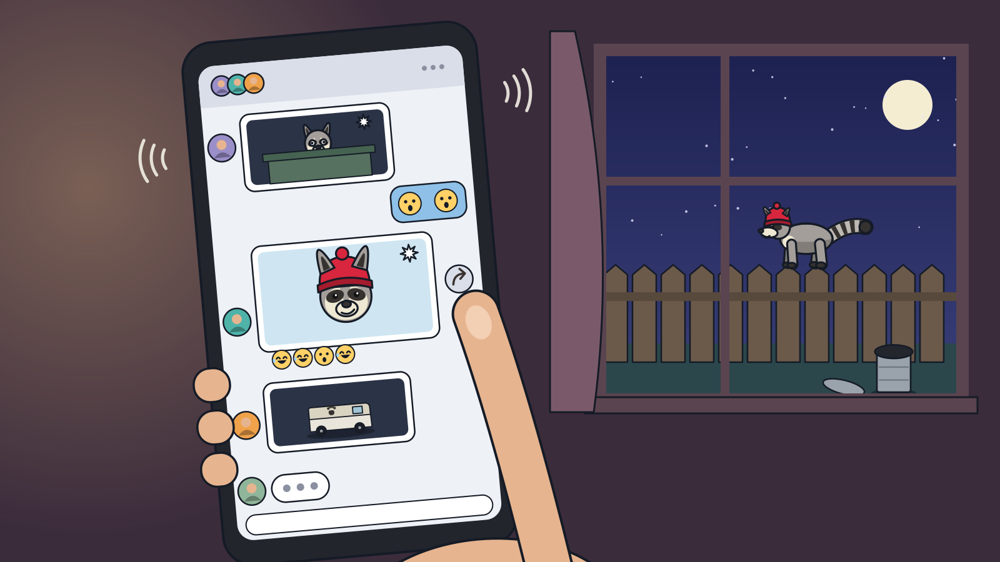

# Storyboard: The Noise Next Door

`the-noise-next-door` · CSYE 7270 · Assignment 2 · Draft v3, 5 Oct 2026

The whole story in 15 panels: from the night a party wakes the raccoon to the night it all starts again. There's no dialogue. Every beat comes across through what the player does and what happens next, with big, slapstick, non-verbal reactions.

## The story in brief

- **Opening (panels 1–2).** Bass from a party vibrates through the raccoon's tree and bounces him awake. He peeks out: a party is in full swing right under his tree, and the grill smells amazing.
- **Level 1: the party (panels 3–8).** Curious, he slides down into the open campsite, and a to-do list of optional pranks appears.
  - He can do the pranks in any order. One of them is music off.
  - Cutting the music works, but in the quiet that follows the party can hear him, and the camper catches him with the marshmallows.
  - He bolts. The fed-up partiers chase him out of the forest, and he swipes the red beanie off the camper's head on the way.
- **The town (panels 9–13).**
  - He comes out of the forest at the edge of town. It's even louder than the party, but there are trash bags everywhere.
  - He raids the diner's dumpster and its raccoon-proof bins, and the neighbourhood group chat fills up with photos of the masked bandit in the beanie.
  - His biggest heist is the block party barbecue. But animal control has been watching, and a trail of marshmallows finally catches him.
- **Ending (panels 14–15).**
  - The beanie camper recognises her beanie in the photos going round. She's the only one who knows where he lives, so she brings him home. It's quiet at last.
  - Then a new party starts below.

## How the storyboard tells it

- **Slapstick, cause then effect.** Every beat is a physical gag: tiptoes, freezes, double-takes, trips and chain reactions. Nobody gets hurt.
  - Some causes carry across panels. Cutting the music in panel 6 is what lets the party hear him in panel 7, and the officer seen waiting in panel 12 springs the trap in panel 13.
- **No dialogue, no speech bubbles.** The humans grumble, gasp, yelp and laugh, and their reactions are big enough to read from the game camera.
- **Text-based ideas from CONCEPT.md became visual events:**
  - The camper's paranoid journal: she gets visibly jumpier instead, with her phone light out in panel 7 and a frying pan in panel 8.
  - The neighbourhood group chat: a phone screen with no words, only photos, emoji and faces (panel 11), plus window photos and a poster with only his picture (panels 10 and 13).
  - "The End?": a cartoon iris-out.
- **The only words on screen** are the to-do list's short labels in panel 4. Every card also has a doodle that works without them, and the in-game cards show only the doodles.

## Continuity

- **The red beanie** is the story's thread, and red is used for nothing else.
  - The camper wears it whenever she's on screen before panel 8 (panels 2, 3, 5 and 7).
  - He swipes it in panel 8.
  - He wears it from panel 9 on (the trap knocks it up off his head in panel 13), and pulls it on again in panel 15.
- **The camper** (mustard jacket, ponytail) looks the same throughout, so she's recognisable when she brings him home in panel 14.
- **The beanie photo** is the same picture everywhere it appears: the poster (panels 10 and 13), the group chat (11) and the camper's phone (14). It's how the campers find him.
- **The marshmallows** he goes after at the party (panels 5 and 7) are what the officer brings to the block party (12) and the bait in the trap (13).
- **Animal control:** the van in the group chat (11) is the one parked at the block party (13). Its paw logo is also on the carrier that traps him (13) and that the camper opens under his tree (14).
- **The diner's pink neon cup** marks the town, from the edge of town (9) to the alley (10).
- **The block party street** has the same houses, bunting and snack table in panels 12 and 13.
- **The party layout never changes:**
  - his tree at the left edge;
  - the fire in the middle with dancers around it;
  - the speaker and tent on the right;
  - the log, the backpack and the cooler near the fire;
  - string lights at the back;
  - the teal station wagon parked behind. The same car drives him home.
- **His tree** has the same trunk and hole in panels 3 and 14. Panels 1, 2 and 15 are inside it or at its hole, and panel 15 mirrors panel 2's framing exactly.
- **Light:**
  - party: blue-violet moonlight, amber firelight, warm string lights;
  - town: harsher white street lights, the diner's neon, the block party's string lights;
  - ending: calm moonlight and headlights.

## Legend

- **Gameplay view:** what the game camera shows. That's a tilted 3/4 view, about 50° down, following the raccoon. *Wide* is the start-of-level view and *medium* is the normal follow distance.
- **Design view:** something outside normal play (the intro, cutscenes, the ending), or a shot that sets how a moment should feel.
- **Frame:** 16:9 throughout (1600 × 900).

## Coverage

| Requirement | Panels |
|---|---|
| First thing the player sees | 1 |
| Core action | 5 |
| Success | 6 |
| Failure | 7 |
| Recovery or retry | 8 (the getaway after the bust) |
| End of a play session | 15 (level 1 ends at 8, the town at 13) |
| Shot sizes | close-up 1, 4, 11 · medium 5, 6, 7, 12, 13 · wide 2, 3, 8, 9, 10, 14, 15 |
| Angles | eye level 1, 4, 8, 11, 13, 14 · high 3/4 3, 5, 6, 10, 12 · high over the shoulder 2, 15 · low 7, 9 |
| Views | gameplay 3, 4, 5, 6, 10, 12 · design 1, 2, 7, 8, 9, 11, 13, 14, 15 |

---

## Opening

## Panel 1 — Good vibrations

- **Shot:** close-up · eye level · design view (intro)
- **Player action:** none yet; the intro plays (any key skips). Each bass thump from the party bounces the sleeping raccoon and his acorn stash into the air. On the third thump an acorn bonks him on the head and his eyes pop open.
- **See:** the raccoon curled up in his tree hole, mid-bounce; acorns in the air; party lights and dancing silhouettes glowing through the opening; vibration lines on the walls.
- **Hear:** muffled bass thumps, chatter and laughter through the wood, crickets underneath; a bonk. *Music:* none yet, only the party's muffled beat.
- **Assets:** CHAR-SLEEP, ENV-HOLE-INSIDE, PROP-ACORNS, SFX-BASS-THUMP, SFX-BONK, AMB-FOREST
- **Design reason (pillar 3, Home should be quiet):** his cosy, quiet home is literally shaken by the party's noise.

## Panel 2 — Party below

- **Shot:** wide · high angle over his shoulder from the hole · design view (intro)
- **Player action:** none; the intro continues. He pops his head out of the hole and looks down. The smell from the grill drifts up and his nose twitches.
- **See:**
  - In the foreground: the back of his head and ears.
  - Below, the party in full swing under his tree: string lights, the speaker, people dancing around the campfire, the grill, the cooler, the tent and the teal station wagon.
  - The camper in the red beanie roasting marshmallows on a log.
  - A dotted smell trail from the grill to his nose.
- **Hear:** the music suddenly clear and loud; chatter and laughter; the crickets drowned out. *Music:* the party's track, playing from the speaker.
- **Assets:** CHAR-PEEK, ENV-CAMPSITE, PROP-STRING-LIGHTS, PROP-SPEAKER, PROP-FIRE, PROP-GRILL, PROP-TENT, PROP-COOLER, PROP-BACKPACK, PROP-CAR, NPC-CAMPER-ROAST, NPC-PARTIER-DANCE, MUS-PARTY
- **Design reason (pillar 3, and curiosity):** the noise invaded his home, but the smell makes him curious. That's why he goes down instead of hiding.

## Level 1: the party

## Panel 3 — Dropping in

- **Shot:** wide · high 3/4 · gameplay view (level start)
- **Player action:** first control. He slides down the trunk headfirst and lands in a puff of dust. From here the player can walk anywhere in the campsite, and the to-do cards slide in at the top right.
- **See:** his tree at the left edge; the whole party laid out in the game camera; five to-do cards arriving in the corner.
- **Hear:** a slide and a soft landing thump; party music from the speaker. *Music:* the party track in the world, with the sneaky piano loop starting underneath.
- **Assets:** CHAR-CLIMB, ENV-TREE, ENV-CAMPSITE, UI-TODO-CARDS, SFX-SLIDE, SFX-LAND, MUS-PARTY, MUS-PIANO-LOOP
- **Design reason (pillar 1, Outsmart the humans):** the whole party is visible from the first frame, so the player can read who's doing what before choosing where to strike.

## Panel 4 — Things to do

- **Shot:** close-up · eye level, straight on · gameplay view (UI)
- **Player action:** opens the to-do list and picks any task, in any order. His paw taps "music off".
- **See:** the to-do list as doodle cards with short labels: steal the marshmallows · spill the cocoa · a sock for a marshmallow · music off (an unplugged speaker and a crossed-out note) · collapse the tent. The party is blurred behind it.
- **Hear:** a paper rustle and a tap. *Music:* the piano loop continues; the party music is muffled while the list is open.
- **Assets:** UI-TODO-LIST, SFX-PAPER, MUS-PIANO-LOOP
- **Design reason (pillar 4, Every prank lands):** each task is a joke the player can picture from its doodle alone, so they choose pranks, not chores.

## Panel 5 — Paws on the zipper

- **Shot:** medium · high 3/4 · gameplay view
- **Player action:** holds Interact at the backpack while the camper roasts marshmallows with her back to him, and the zipper opens tooth by tooth. A dancer's elbow swings past his head and he freezes mid-pose.
- **See:** the raccoon up on his hind legs with his paws in the backpack and marshmallows peeking out; a sweat drop and freeze marks; the camper in the red beanie facing the fire; the marshmallow card highlighted.
- **Hear:** zipper ticks under the party music; a whoosh as the elbow swings by. *Music:* the piano loop, steady.
- **Assets:** CHAR-FIDDLE, PROP-BACKPACK, PROP-MARSHMALLOWS, NPC-CAMPER-ROAST, NPC-PARTIER-DANCE, UI-TODO-CARDS, SFX-ZIP, SFX-WHOOSH, MUS-PIANO-LOOP
- **Design reason (pillar 1):** the opening exists because everyone is busy with their routine, roasting and dancing. Reading that is the whole skill.

## Panel 6 — Music off

- **Shot:** medium · high 3/4 · gameplay view
- **Player action:** grabs the speaker's plug in his teeth, yanks it out and slinks away dragging the cord.
- **See:** the plug popping out with an impact star; music notes falling upside down; the dancers frozen mid-move in silly poses; a marshmallow dropping off someone's stick; crickets back in the grass; the music-off card crossed off with a sparkle.
- **Hear:** the music winds down to silence, the crickets return, then a short piano flourish. *Music:* the party track stops; piano flourish.
- **Assets:** CHAR-DRAG, PROP-SPEAKER, PROP-PLUG, NPC-PARTIER-FREEZE, UI-TODO-CARDS, SFX-PLUG-POP, SFX-MUSIC-WINDDOWN, SFX-FLOURISH, AMB-FOREST
- **Design reason (pillars 4 and 3):** the prank lands with a big, readable reaction, and for a moment his home sounds the way it should.

## Panel 7 — Busted

- **Shot:** medium · low angle · design view (how being caught should feel; in game this plays in the 3/4 camera)
- **Player action:** goes back for the marshmallows. With the music off the party has gone quiet, and the bag's crinkle carries. She spins round with her phone light. He does a double-take with his fur on end and the bag flies out of his mouth. She lunges and catches her foot on the cooler.
- **See:** the camper in the red beanie looming with her phone light on him; the raccoon mid-jump with spiky fur and a double-take; the marshmallow bag flying with crinkle marks round it, and marshmallows everywhere; her foot hooked on the cooler.
- **Hear:** no music to hide under, so the crinkle sounds huge; a gasp, a yelp, and a soft thud as she trips, unhurt. *Music:* the piano cuts out for a beat.
- **Assets:** CHAR-STARTLED, NPC-CAMPER-LUNGE, PROP-PHONE, PROP-MARSHMALLOWS, PROP-COOLER, SFX-CRINKLE, SFX-GASP-YELP, SFX-THUD
- **Design reason (pillar 2, Mischief, not malice):** getting caught is a pratfall for both of them, never a punishment. And it was his own prank, the silence, that gave him away.

## Panel 8 — The red beanie

- **Shot:** wide · eye level, side-on · design view (how the getaway should feel; in game the player steers it in the 3/4 camera)
- **Player action:** runs for it. Being caught isn't game over: the player steers the getaway.
  - The fed-up partiers give chase: one trips over a tent rope, two bonk heads, and the camper's frying pan swings and misses.
  - As he zips past her, he swipes the red beanie off her head and vanishes into the trees with it. Reaching the trees ends level 1.
- **See:** the chase under the moon; impact stars; the pan's missed swing; a dotted trail from her bare head to the beanie in his mouth; dark trees swallowing him.
- **Hear:** crashes, boings and yelps. *Music:* a loud, fast piano chase that ends on a playful sting.
- **Assets:** CHAR-RUN-BEANIE, NPC-CAMPER-CHASE, NPC-PARTIER-TRIP, NPC-PARTIER-REEL, PROP-PAN, PROP-BEANIE, SFX-CRASH, SFX-BOING, MUS-PIANO-CHASE
- **Design reason (pillar 2):** this is the recovery. The bust turns into a getaway he wins, the humans fall over each other, and he leaves with a trophy.

## The town

## Panel 9 — Edge of town

- **Shot:** wide · low angle, at his height · design view (the start of the town)
- **Player action:** none; a short intro, then the player takes control. He comes out of the trees at the edge of town and stops dead. The noise rolls over him, and then the smell: trash bags everywhere. He grins.
- **See:**
  - On the left, the last dark trees of the forest, with fireflies.
  - On the right, the town lit up: the diner's pink neon cup on its roof, streetlights, houses, a water tower and a siren's blue glow.
  - A car coming down the road with its headlights on.
  - Trash bags and a bungee-corded bin along the road.
  - Noise lines rolling in towards him, and a smell trail from the nearest bags to his nose.
- **Hear:** the forest's crickets fade under traffic, a horn, a distant siren and the neon's buzz; a long sniff. *Music:* the piano loop changes into its town version.
- **Assets:** CHAR-SNIFF, ENV-TOWN-EDGE, PROP-TRASH-BAGS, PROP-BIN, PROP-BUNGEE, PROP-TOWN-CAR, SFX-HORN, SFX-SNIFF, AMB-FOREST, AMB-TOWN, MUS-PIANO-TOWN
- **Design reason (pillar 3, Home should be quiet):** the town is even louder than the party he fled, but it smells like dinner, so in he goes.

## Panel 10 — The masked bandit

- **Shot:** wide · high 3/4 · gameplay view
- **Player action:** works through the town's jobs, the three from CONCEPT.md: raid the diner dumpster · beat the bungee-corded bin · steal from the block party barbecue. Here the dumpster is done, and he wrestles a bungee cord off a raccoon-proof bin. The cord twangs back and launches the lid like a frisbee.
- **See:**
  - An alley behind the diner, under its buzzing neon cup sign.
  - The raided dumpster with its bags pulled out; dented bins with yellow bungee cords; the raccoon in the red beanie on one of them; the lid spinning away.
  - People leaning out of windows snapping phone photos.
  - A lamppost poster showing only his picture in the beanie.
  - The town's to-do cards: the dumpster crossed off, the bungee bin highlighted.
- **Hear:** traffic, a distant siren, neon buzz, a bungee twang, camera clicks. *Music:* the town version of the piano loop.
- **Assets:** CHAR-BEANIE-FIDDLE, ENV-TOWN-ALLEY, PROP-BIN, PROP-BUNGEE, PROP-POSTER, NPC-WATCHER, UI-TODO-CARDS, SFX-TWANG, SFX-CAMERA-CLICK, AMB-TOWN, MUS-PIANO-TOWN
- **Design reason (pillar 4, Every prank lands):** each job pays off twice, once with the gag and once with the town noticing him: phones out, and his face on a poster.

## Panel 11 — The group chat

- **Shot:** close-up · eye level · design view (a short cutscene between town jobs)
- **Player action:** none; a short cutscene. A neighbour's phone buzzes nonstop as the group chat fills with photos of the masked bandit. Their thumb goes to share the beanie photo. Through the window behind them, the bandit himself is on the back fence.
- **See:**
  - The phone filling the frame. The chat has no words, only photos, emoji and coloured avatars.
  - The photos: his eyes over the rim of the diner dumpster; him in the beanie; and the animal-control van that someone has called.
  - Shocked and laughing emoji, and someone typing.
  - Through the window: the raccoon on the back fence in his beanie, next to a bin he has tipped over.
- **Hear:** message pings stacking up faster and faster; muffled traffic outside. *Music:* the town piano loop, with a pluck on every ping.
- **Assets:** ENV-LIVING-ROOM, PROP-PHONE-CHAT, NPC-NEIGHBOUR-HAND, CHAR-PERCH, PROP-BIN, PROP-ANIMAL-VAN, SFX-PHONE-PING, AMB-TOWN, MUS-PIANO-TOWN
- **Design reason (pillar 4, Every prank lands):** the whole town is talking about him without a word, and the beanie photo they pass round is the one the campers will recognise.

## Panel 12 — The barbecue heist

- **Shot:** medium · high 3/4 · gameplay view
- **Player action:** his biggest heist. As the grill master flips a burger sky-high and every head turns to watch, he grabs the end of a string of sausages and runs. It pays out behind him across the block party: a kid limbos under it and a sausage dog leaps for it.
- **See:**
  - The block party street: bunting, string lights, chalk drawings and confetti.
  - The burger mid-flip and the neighbours staring up at it.
  - The string of sausages from the grill to the raccoon's mouth, with the kid and the dog.
  - At the back, the animal-control officer peeking over the snack table with a bag of marshmallows.
  - The town's to-do cards: the dumpster and the bungee bin crossed off, the barbecue highlighted.
- **Hear:** sizzling, the crowd's "ooh" at the flip, a happy bark, and the sausages zipping off the grill. *Music:* the town piano loop picks up speed.
- **Assets:** CHAR-RUN, ENV-BLOCK-PARTY, PROP-GRILL, PROP-SAUSAGES, PROP-BURGER, PROP-MARSHMALLOWS, NPC-GRILL-MASTER, NPC-NEIGHBOUR-WATCH, NPC-KID-LIMBO, NPC-DACHSHUND, NPC-OFFICER-LURK, UI-TODO-CARDS, SFX-SIZZLE, SFX-CROWD-OOH, SFX-BARK, SFX-WHOOSH, MUS-PIANO-TOWN
- **Design reason (pillar 1, Outsmart the humans):** the campsite's lesson pays off, because everyone is watching the flip and not him. Only the player spots the officer waiting at the back.

## Panel 13 — The marshmallow trap

- **Shot:** medium · eye level, side-on · design view (the cutscene that ends the town)
- **Player action:** follows a trail of marshmallows across the block party and into an open carrier. Taking the last one springs the trap: the animal-control officer, waiting behind the snack table, yanks a string, the stick propping the door open flies out, and the door slams shut. This ends the town.
- **See:**
  - The carrier hopping as the door slams, with impact marks.
  - His face behind the bars: eyes wide, a marshmallow in his teeth, the beanie knocked up off his head.
  - The stick flying off on its string to the officer, who pops up behind the snack table, laughing, net held high.
  - The trail of marshmallows leading in.
  - The block party: bunting, string lights, balloons, a pie, a cake and a punch bowl; neighbours snapping photos from their windows; the animal-control van with the carrier's paw logo; his poster on the lamppost.
- **Hear:** block-party chatter; munching; a snap and a clang as the door shuts; a gasp, then laughter, cheers and camera clicks. *Music:* the town piano loop stops dead on the clang, and a sad trombone goes "wah-wah".
- **Assets:** CHAR-TRAPPED, ENV-BLOCK-PARTY, PROP-CARRIER, PROP-MARSHMALLOWS, PROP-TRAP-STICK, PROP-NET, PROP-ANIMAL-VAN, PROP-POSTER, PROP-STRING-LIGHTS, NPC-OFFICER-YANK, NPC-WATCHER, SFX-SLAM, SFX-CROWD-CHEER, SFX-CAMERA-CLICK, SFX-SAD-TROMBONE, AMB-TOWN, MUS-PIANO-TOWN
- **Design reason (pillar 1, turned around):** for once the humans outsmart him, using the weakness the player saw at the party, so the capture feels fair and funny, not cruel.

## Ending

## Panel 14 — Home at last

- **Shot:** wide · eye level · design view (ending cutscene)
- **Player action:** none; this cutscene follows the capture.
  - The beanie camper, the only person who knows where he lives, kneels under his tree and opens the animal-control carrier, with the beanie photo from the group chat on her phone.
  - He tumbles out, straightens the beanie and scurries up to his hole.
  - Her friend shrugs and they drive off.
- **See:** his tree and hole in moonlight; the teal station wagon's headlights; the open carrier; the camper kneeling with the beanie photo on her phone; the raccoon mid-tumble in the beanie; a dotted arrow up the trunk to his hole; crickets in the grass.
- **Hear:** the engine idling, a car door, the car fading away, then only crickets. *Music:* the theme, slow and gentle.
- **Assets:** CHAR-TUMBLE, ENV-TREE, PROP-CARRIER, PROP-CAR, PROP-PHONE, NPC-CAMPER-KNEEL, NPC-FRIEND-SHRUG, SFX-ENGINE, SFX-CAR-DOOR, AMB-FOREST, MUS-THEME-SLOW
- **Design reason (pillars 2 and 3):** the humans turn out kind, and for the first time in the game his home is quiet.

## Panel 15 — Here we go again

- **Shot:** wide · high angle over his shoulder from the hole · design view (ending; mirrors panel 2)
- **Player action:** none. A new party starts thumping below. He pulls on the red beanie, turns to grin at us and rubs his paws together as the picture irises out on him.
- **See:** the same framing as panel 2, with a new group, an orange van and a new roaster on the log; the raccoon in the beanie with half-closed, scheming eyes; the iris closing in.
- **Hear:** the bass thump and chatter return. *Music:* the playful piano kicks back in and ends on a flourish.
- **Assets:** CHAR-GRIN-BEANIE, ENV-CAMPSITE, PROP-VAN, NPC-PARTIER-DANCE, SFX-BASS-THUMP, MUS-PIANO-LOOP, SFX-FLOURISH
- **Design reason (pillar 1, and the story's loop):** the first shot comes back with the beanie on, so the ending promises more mischief without a single word.

---

## Open choices (yours to decide)

- **Opening vs. CONCEPT.md.** This storyboard uses your new opening, where the party is already in full swing when he wakes. CONCEPT.md still describes campers arriving with car doors slamming.
- **How level 1 ends.** On the board, the bust in panel 7 leads straight into the getaway that ends the level. Still open: does any bust end level 1, or only one after he's done enough tasks? Claude's suggestion is 3 of the 5. If you choose that, earlier busts need a smaller consequence.
- **One town level or two?** You call them the city levels. The board treats the town as one level, with CONCEPT.md's three town jobs as its to-do cards. The block party (panels 12 and 13) could be a level of its own.
- **The music.** Claude's suggestion:
  - the party's music plays from the speaker in the world, with the sneaky piano loop underneath;
  - cutting the music leaves only crickets and piano, which is also why the party can hear him in panel 7.
- **Gags Claude added:**
  - the acorn bonk;
  - the sniffing nose;
  - the elbow near-miss;
  - the bag's crinkle giving him away;
  - the cooler trip;
  - the frying pan;
  - the noise and the smell hitting him at once at the edge of town;
  - the bungee frisbee;
  - the window photos and the poster;
  - the group chat told only in photos and emoji, with the bandit on the fence outside;
  - the burger flip, the sausage string, the limbo and the sausage dog;
  - the officer waiting with marshmallows, the trail, the stick on a string and the sad trombone;
  - the iris-out.
- **Task cards.** Doodles with short labels, as drawn, or doodles only.

## Asset IDs used above

| Group | IDs |
|---|---|
| Raccoon | CHAR-SLEEP, CHAR-PEEK, CHAR-CLIMB, CHAR-FIDDLE, CHAR-DRAG, CHAR-STARTLED, CHAR-RUN-BEANIE, CHAR-SNIFF, CHAR-BEANIE-FIDDLE, CHAR-PERCH, CHAR-RUN, CHAR-TRAPPED, CHAR-TUMBLE, CHAR-GRIN-BEANIE |
| People and animals | NPC-CAMPER-ROAST, NPC-CAMPER-LUNGE, NPC-CAMPER-CHASE, NPC-CAMPER-KNEEL, NPC-PARTIER-DANCE, NPC-PARTIER-FREEZE, NPC-PARTIER-TRIP, NPC-PARTIER-REEL, NPC-WATCHER, NPC-NEIGHBOUR-HAND, NPC-NEIGHBOUR-WATCH, NPC-GRILL-MASTER, NPC-KID-LIMBO, NPC-DACHSHUND, NPC-OFFICER-LURK, NPC-OFFICER-YANK, NPC-FRIEND-SHRUG |
| Places | ENV-HOLE-INSIDE, ENV-TREE, ENV-CAMPSITE, ENV-TOWN-EDGE, ENV-TOWN-ALLEY, ENV-LIVING-ROOM, ENV-BLOCK-PARTY |
| Props | PROP-ACORNS, PROP-STRING-LIGHTS, PROP-SPEAKER, PROP-PLUG, PROP-FIRE, PROP-GRILL, PROP-TENT, PROP-COOLER, PROP-BACKPACK, PROP-MARSHMALLOWS, PROP-PHONE, PROP-PAN, PROP-BEANIE, PROP-CAR, PROP-VAN, PROP-TRASH-BAGS, PROP-TOWN-CAR, PROP-BIN, PROP-BUNGEE, PROP-POSTER, PROP-PHONE-CHAT, PROP-SAUSAGES, PROP-BURGER, PROP-CARRIER, PROP-TRAP-STICK, PROP-NET, PROP-ANIMAL-VAN |
| UI | UI-TODO-CARDS, UI-TODO-LIST |
| Sound | SFX-BASS-THUMP, SFX-BONK, SFX-SLIDE, SFX-LAND, SFX-PAPER, SFX-ZIP, SFX-WHOOSH, SFX-PLUG-POP, SFX-MUSIC-WINDDOWN, SFX-FLOURISH, SFX-CRINKLE, SFX-GASP-YELP, SFX-THUD, SFX-CRASH, SFX-BOING, SFX-HORN, SFX-SNIFF, SFX-TWANG, SFX-CAMERA-CLICK, SFX-PHONE-PING, SFX-SIZZLE, SFX-CROWD-OOH, SFX-BARK, SFX-SLAM, SFX-CROWD-CHEER, SFX-SAD-TROMBONE, SFX-CAR-DOOR, SFX-ENGINE |
| Music and ambience | MUS-PARTY, MUS-PIANO-LOOP, MUS-PIANO-CHASE, MUS-PIANO-TOWN, MUS-THEME-SLOW, AMB-FOREST, AMB-TOWN |

The slice won't need all of these. Which ones it builds is decided later, in CHANGE-BRIEF.md.

## Provenance

- **Your story and decisions.** The story comes from CONCEPT.md; see its provenance note. In chat on 4–5 Oct 2026 you decided:
  - the party is already in full swing when he wakes;
  - he comes down out of curiosity into an open first level with optional fun tasks;
  - the game is slapstick, with no dialogue, told through actions and events;
  - the storyboard covers the whole story (12 panels at first, 15 since draft v3);
  - gameplay panels use a tilted 3/4 camera;
  - Claude draws the thumbnails;
  - the raccoon's look follows your Gemini image.
- **Your changes for draft v2 (5 Oct 2026):**
  - music off stays on the to-do list (Claude first suggested it as "unplug the speaker"), and its panel comes before Busted;
  - the beanie steal comes straight after Busted;
  - Shooed off is cut;
  - one more panel in the town.
- **Your change for draft v3 (5 Oct 2026):** three more town panels before he's caught, because the town was too light.
- **Claude's contributions:**
  - the shot list and the wording of every panel;
  - the specific gags and choices listed under Open choices, including what happens in the marshmallow trap and the crinkle that links panels 6 and 7;
  - making panel 8 the recovery beat once Shooed off was cut, since the brief asks for one;
  - staging the three new town panels from CONCEPT.md's Act 2 (the edge of town, the group chat, the block party barbecue), and the town's to-do cards from its town jobs;
  - the thumbnails, drawn in code by `design/storyboard/make_thumbnails.py`. Run `python design/storyboard/make_thumbnails.py` to redraw them after edits.
- **Generative models:** none. No panel was made with an image generator.
- **Your edits:** ________
