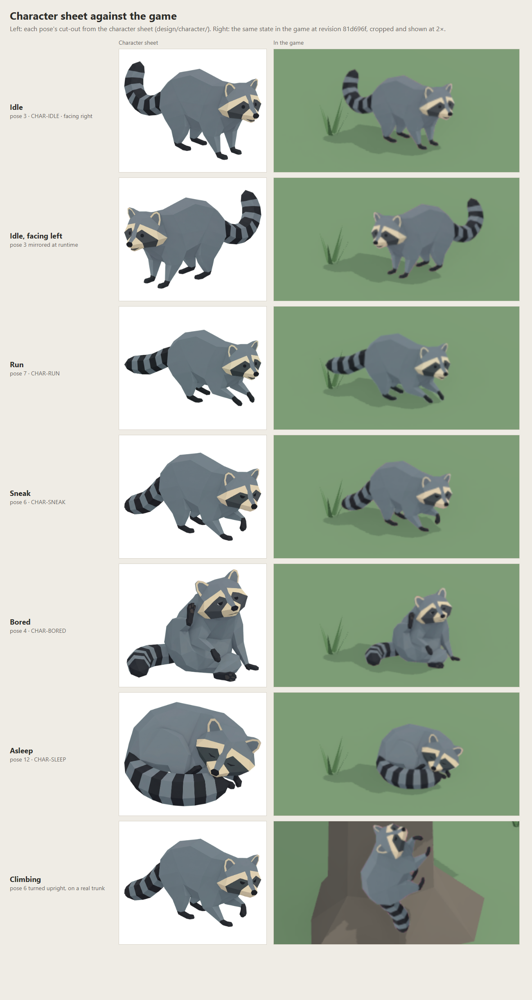
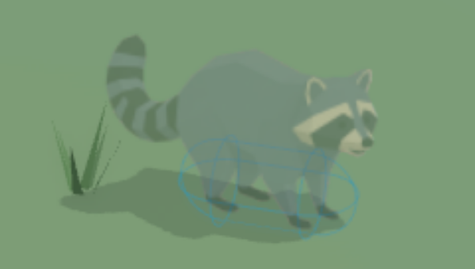
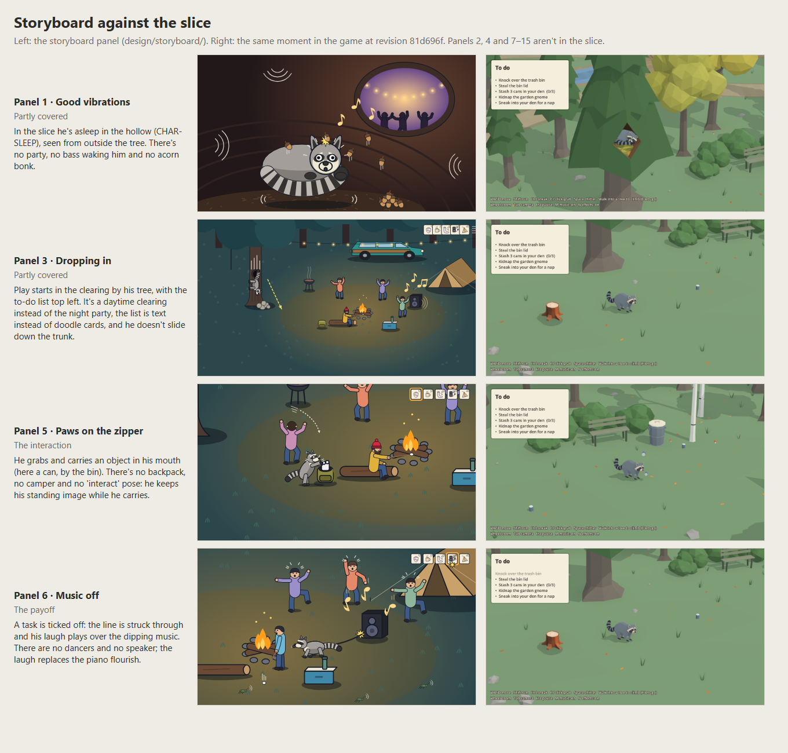

# Test report: The Noise Next Door

`the-noise-next-door` · CSYE 7270 · Assignment 2 · 6 Oct 2026

What the slice was tested for, how, and what actually happened.

**What was tested**

| | |
|---|---|
| Source revision | `81d696f`. This report and its screenshots were committed after it and don't change the game. |
| Engine | Godot 4.7.2 stable, official build `ed1daf0bf`, Forward+ renderer, Vulkan 1.4 |
| Machine | Windows 11 Home (10.0.26300), NVIDIA GeForce RTX 4050 Laptop GPU, 16 GB RAM |
| Who tested | The author played the slice; that's the human playtest, in section 7. Claude Code ran the automated check, the fresh-copy run and the screenshots. No one else played or listened. |

## Summary

| Check | Result | Evidence |
|---|---|---|
| Startup from a fresh copy | Pass | A clone of `81d696f` imports with no errors, passes the sound check and runs (section 1) |
| Controls and state changes | Pass | Every state, shown in the game (section 2); the author played with the normal controls (section 7) |
| Character against the sheet | Matches, with the differences listed | [character-vs-sheet.png](design/test-report/character-vs-sheet.png), [collision-zoom.png](design/test-report/collision-zoom.png) |
| Storyboard against the slice | 4 panels partly covered, 11 not | [storyboard-vs-slice.png](design/test-report/storyboard-vs-slice.png) |
| Sound events, once per occurrence | Pass, automated and by ear | Section 4 |
| Music loop, pause and end | Pass, automated and by ear | Section 5 |
| Muted play | Partly readable | Section 6 |
| Automated check | 17 of 17 pass, and it fails when a rule is broken | Section 8 |

## 1. Startup and controls

**From a fresh copy.** `git clone` of `81d696f` into an empty folder, with no `.godot` import cache:
- `godot --headless --path . --import` finished with no errors in 8.7 s.
- The automated sound check then passed 17 of 17 (exit code 0).
- The game started and rendered: [fresh-copy.png](design/test-report/fresh-copy.png).
- On Windows, `Play The Noise Next Door.bat` runs the import itself the first time (README).

**Controls and states:**

| State | Input | Shown in |
|---|---|---|
| Idle | No input | [state-idle.png](design/test-report/state-idle.png) |
| Run | Shift while moving | [state-run.png](design/test-report/state-run.png); the sound check runs him with simulated keys |
| Sneak | Ctrl or C | [state-sneak.png](design/test-report/state-sneak.png) |
| Bored | 5 seconds with no input | [state-bored.png](design/test-report/state-bored.png) |
| Asleep | Sneak and keep still in the den; he hops up into the hollow | [rest.png](design/test-report/rest.png), from the real nap |
| Climbing | Walk into a trunk; W and S climb, A and D go round, E lets go | [state-climb.png](design/test-report/state-climb.png), from a real climb; the sound check climbs too |
| Facing left | Moving left on screen | [state-idle-left.png](design/test-report/state-idle-left.png) |
| Grab and carry | E or a click | [grab.png](design/test-report/grab.png) |
| Pause, mute | Esc; M for music, N for effects | The sound check (section 8) |

The idle, run, sneak, bored and asleep screenshots show the state itself, with `--pose=<state>`. The nap, the climb, the grab and the ticked-off task use the real game code, driven by `--rest-test`, `--climb-test`, `--grab-test` and `--tick-test` (see `scripts/main.gd`).

## 2. Character against the sheet



**What matches.** The game draws the character sheet's own cut-outs, so in every state the pose, proportions, palette and markings are the sheet's. All the states are scaled from one face size, so he doesn't change size when his state changes. Mirroring for the left works (row 2).

**Differences:**
- **Climbing** shows the sneak pose turned upright, because no climbing pose was generated. This is CHANGE-BRIEF.md's planned fallback.
- **There are no back views.** Walking away from the camera still shows his front, as CHANGE-BRIEF.md planned.
- **Carrying.** He keeps his current image, and the carried object sits at the hidden 3D model's mouth. Facing right it lines up with his mouth (grab.png). Walking toward or away from the camera wasn't checked.
- **Size.** The idle image covers the same screen area as the earlier 3D raccoon: 139 × 99 px at the default zoom in a 1280 × 720 window.

**Collision, in the game.** Here he's drawn half see-through, with Godot's collision shapes shown (`--debug-collisions` and `--see-collision`). `--see-collision` is a debug option added just after `81d696f` and committed with this report. It changes only how he's drawn for this screenshot.



The capsule (cyan) covers his legs and lower body. His head, back and most of his tail reach past it, as the character sheet's overlay shows ([design/character/collision.png](design/character/collision.png)). That's fair, because nothing in the slice hits those parts: he never jumps or ducks.

## 3. Storyboard against the slice



| Panel | In the slice | Differences |
|---|---|---|
| 1 Good vibrations | Partly | He's asleep in the hollow, seen from outside the tree. There's no party, no bass waking him and no acorn bonk. |
| 3 Dropping in | Partly | Play starts in the clearing by his tree, with the to-do list. It's a daytime clearing instead of the night party, the list is text instead of doodle cards, and he doesn't slide down the trunk. |
| 5 Paws on the zipper | The interaction | He grabs and carries things in his mouth. There's no backpack, no camper and no interact pose. |
| 6 Music off | The payoff | A ticked-off task is struck through, and his laugh plays over the dipping music. There are no dancers and no speaker, and the laugh replaces the piano flourish (CHANGE-BRIEF.md v2). |
| 2, 4, 7–15 | No | They need the party, humans, the beanie or the town. |

The storyboard's gameplay thumbnails were drawn for a camera about 50° down. The game uses the 27° camera the author picked; see the storyboard's legend, v6.

## 4. Sound events

| Sound | Event | Automated: scripted input | Expected | Counted |
|---|---|---|---|---|
| SFX-CHITTER | Space | 5 quick presses, then 1 press held with 8 key repeats | 6 | 6 |
| SFX-RUN | Running | 2 runs, with Shift tapped off and on 10 times during the first | 2 | 2 |
| SFX-CLIMB | Moving on a trunk | 2 climbs, clinging still between them | 2 | 2 |
| SFX-TASK-LAUGH | A task ticked off | 5 tasks over 4 frames, 2 of them in the same frame | 4 | 4 |

**By ear,** in the author's playtest at 22:59 on 6 Oct, asked whether each sound played once per action: "Yes, all fine".

**Sound never decides what happens.** Every sound plays after the game's state has already changed, and muting touches only the audio buses (`toggle_mute()` in `scripts/main.gd`). The automated check mutes and unmutes both buses mid-run, and the game carries on.

## 5. Music

| Behaviour | Planned (CHANGE-BRIEF.md) | Result |
|---|---|---|
| Seamless loop | No click or gap at the wrap | **By ear,** the author: "Yes, all fine". **Automated:** the loop marker covers the whole file, for the music and both effect loops. The cut is described in SOURCES.md (MUS-PIANO-LOOP). |
| Pause (Esc) | Muffled and about 8 dB quieter; the effects pause | **Automated:** while paused, the low-pass filter is on and the music bus is at −8 dB. After unpausing, the filter is off and the bus is back at 0 dB. |
| A task ticked off | The music dips about 4 dB under the laugh | Built as planned in `_play_task_laugh()`. Not measured by the automated check. |
| End: all tasks done | The music fades out over 3 s and stops | **Automated:** after the last task, the music has stopped. |
| Failure | Not in this slice | There are no humans, so no failure state. |

## 6. Muted play

With both buses muted (M and N), the author found the slice **partly** readable (22:59, 6 Oct). Which moments got lost wasn't noted.

Each sound has a visual partner in the slice:
- running: his run image;
- climbing: his climbing image, moving on the trunk;
- the chitter: a quick squash and hop;
- a ticked-off task: the struck-through line;
- the end: the "Mischief managed!" banner.

## 7. The author's playtest

The author played the slice on 6 Oct 2026, with sound on and then muted. These are their notes, quoted as they typed them (22:57):
> "need to make the animations smother and the gameplay feels a bit blovcky need to work on the same"
>
> "gameplay wise i need to update the game system such that i feels rewarding for the tasks to complete for the user to pursue the tasks more"
>
> "need to think abt the AI of the other NPC charaters of how pusnishing it should be to interact with them for loss"

Their answers to Claude's follow-up questions (22:59):

| Question | Answer |
|---|---|
| With sound on, did the music loop repeat without a click or gap, and did each sound play once per action? | "Yes, all fine" |
| With everything muted, could you still follow what was happening? | "Partly" |
| How loud were the sound effects against the music? | "Effects too quiet" |
| Should Claude smooth the animation now, as the documented fix? | "No, record it as a next step" |

## 8. The automated check

```bash
godot --headless --path . -- --sound-test
```

`scripts/sound_test.gd` plays a scripted input sequence:
- quick and held Space presses;
- running, with Shift tapped off and on;
- climbing, then clinging still;
- tasks ticked off, two in the same frame.

It counts how often each sound effect starts, and checks the pause, mute, loop and end behaviour. It prints a table, and its exit code is 0 only if every check passes. On `81d696f` it passed all 17 checks, both in the working copy and in the fresh clone:

```text
pass  Paused: the game stops                               expected true   got true
pass  Paused: the music is muffled                         expected true   got true
pass  Paused: the music is 8 dB quieter                    expected -8.0   got -8.0
pass  Unpaused: the game runs                              expected false  got false
pass  Unpaused: the muffling is off                        expected false  got false
pass  Unpaused: the music is back to full                  expected 0.0    got 0.0
pass  M and N: both buses muted                            expected true   got true
pass  M and N again: both unmuted                          expected false  got false
pass  SFX-CHITTER: 5 quick presses + 1 held press          expected 6      got 6
pass  SFX-RUN: 2 runs, Shift tapped during the first       expected 2      got 2
pass  SFX-CLIMB: 2 climbs, clinging still between          expected 2      got 2
pass  SFX-TASK-LAUGH: 5 tasks over 4 frames                expected 4      got 4
pass  Every task done                                      expected true   got true
pass  End: the music has stopped after its fade            expected false  got false
pass  Loop marker over the whole file: forest-loop.wav     expected true   got true
pass  Loop marker over the whole file: run-loop.wav        expected true   got true
pass  Loop marker over the whole file: climb-loop.wav      expected true   got true
RESULT: all checks passed
```

**It can fail.** To prove the check isn't hollow, the loops' hold time (`LOOP_HOLD` in `scripts/player.gd`) was set to 0 for one run. That's the rule that stops a quick Shift tap restarting the running loop. The check then reported `SFX-RUN expected 2 got 12` and exited with code 1. The setting was put back to 0.12 s. No check has been removed or weakened to get a green result.

## 9. Changes made because of what was seen or heard

| What was observed | By whom | What changed | Commit |
|---|---|---|---|
| The sound effects were too quiet against the music | The author's playtest | The effects went up 4 dB and the music down 3 dB, so the effects are 7 dB louder than the music than before. Not re-checked by ear yet. | `81d696f` |
| The generated ground texture, seen on the forest floor in the game: "i dont like the ground" | The author | The texture was switched off and the plain grass kept. A generated stump became the environment asset. | `ef1a803`, `1b300b4` |
| The planned 50° camera "still doesnt feel right" | The author | The author set the camera by eye with the Tab panel: 27° down, a 15° lens | `dcae18a` |
| On a trunk he was half hidden in the bark, and sank into the ground when turned upright | Claude, from screenshots | He's now drawn a little toward the camera and turns about his middle | `1b300b4` |
| Green gaps between the legs in two cut-outs, and the capsule drawn too far toward his head | Claude, from the sheets | The gap filling now keeps background-coloured gaps, and the capsule sits between his paws | `7296e08` |
| His fur measured as bright as the generated ground (1.0:1) | Claude's palette check | Recorded in CHARACTER-SHEET.md v5. The ground was then rejected for its look. Against the plain grass (`#7D9D76`, measured from start.png at `81d696f`), his three fur tones measure 1.3 to 2.0:1 and his charcoal markings 4.8:1. | `d89c0bb` |

## 10. Limitations

- **Static images:** one image per state, so a change of state snaps from one picture to the next. The author found the animation "a bit blovcky".
- **No back views:** walking away from the camera still shows his front.
- **No humans, so no failure state:** the slice doesn't test being caught.
- **Climbing** reuses the sneak pose, turned upright.
- **The chitter and the task laugh** are two takes of the same laugh.
- **Carried objects** follow the hidden 3D model's mouth, which was only checked facing left or right.
- **Contrast:** his fur is close in brightness to the grass (1.3 to 2.0:1). His charcoal markings (4.8:1) carry his shape.
- **Muted play** was only partly readable, and which moments were lost wasn't noted.
- **The new sound levels** haven't been re-checked by ear.

## 11. Next steps toward the full game

From the author's notes:
1. **Smoother animation and less blocky play.** For example, motion between his images, such as a bob while he moves, a softer turn than an instant mirror, and a little squash when his state changes.
2. **Tasks that feel rewarding**, so the player wants to pursue them.
3. **The other characters' behaviour, and how punishing an encounter should be.** CONCEPT.md's starting point: suspicion builds in stages, and being caught costs the item he's holding and some time, never a finished job.

---

**Provenance.**
- **The author:** played the slice, wrote the notes in section 7, and answered the four questions.
- **Claude Code:** the automated check, the fresh-copy run, the screenshots and comparison sheets, the volume change the playtest asked for, and this report's wording.
- **Generative models:** none were used for this report.
